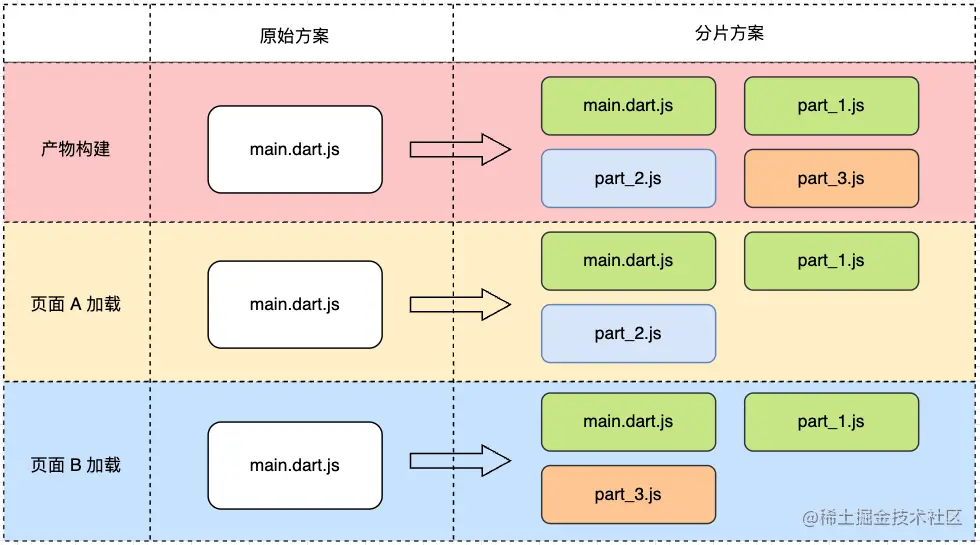
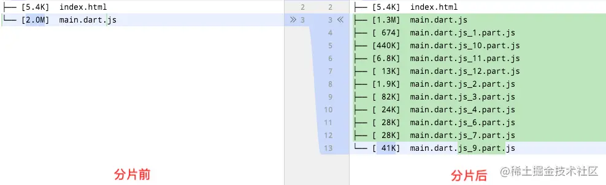

## 背景

默认情况下，Flutter 打包 web 以后，首次打开页面需要加载大量的资源，这就需要做首屏加载优化。

## 渲染引擎

通过分析，canvaskit 和 skwasm 需要加载较大的引擎包，很难优化，目前选择 3.22 版本，故选择 HTML Render 引擎

> Flutter Web 计划在 2025 开始弃用 HTML Render。如果是 2025 年的新版本，可以考虑使用 skwasm 引擎。

## 字体图标裁剪

体积裁剪，通过 bulid apk shaking icon，得到一个裁剪后的字体库，替换调 Flutter Web 打包的对应字体产物

先在 App 项目构建 apk：

``` bash
flutter build apk --tree-shake-icons
```

找到 `build/host/intermediates/assets/release/mergeReleaseAssets/flutter_assets/fonts/MaterialIcons-Regular.otf`
将该文档复制到 `web/fonts/` 文件夹

|文件采样| 压缩前 | 压缩后 | 压缩率 |
|--- | --- | --- | --- |
|MaterialIcons-Regular.otf| 1.5M | 2k | 1% |


## 延迟加载

使用延迟加载拆分文件，当前页面不需要的使用的代码延迟加载

Dart 中提供了 defered 关键词，用于延迟加载组件。


参考下方实现一个 DeferredWidget 组件

```dart
import 'dart:async';
import 'package:ealing_widget/common/common_color.dart';
import 'package:flutter/material.dart';

typedef LibraryLoader = Future<void> Function();
typedef DeferredWidgetBuilder = Widget Function();

///延迟加载组件
class DeferredWidget extends StatefulWidget {
  DeferredWidget(this.libraryLoader, this.createWidget, {Key? key, Widget? placeholder}) : placeholder = placeholder ?? Container(color: CommonColors.color_widget_background), super(key: key);

  final LibraryLoader libraryLoader;
  final DeferredWidgetBuilder createWidget;
  final Widget placeholder;
  // 存储 libraryLoader 对应的 future 数据
  static final Map<LibraryLoader, Future<void>> _moduleLoaders = {};
  // 存储已经预加载过了的 libraryLoader
  static final Set<LibraryLoader> _loadedModules = {};

  static Future<void>? preload(LibraryLoader loader) {
    if (!_moduleLoaders.containsKey(loader)) {
      _moduleLoaders[loader] = loader().then((dynamic _) {
        _loadedModules.add(loader);
      });
    }
    return _moduleLoaders[loader];
  }

  @override
  _DeferredWidgetState createState() => _DeferredWidgetState();
}

class _DeferredWidgetState extends State<DeferredWidget> {
  Widget? _loadedChild;

  @override
  void initState() {
    if (DeferredWidget._loadedModules.contains(widget.libraryLoader)) {
      _onLibraryLoaded();
    } else {
      DeferredWidget.preload(widget.libraryLoader)?.then((dynamic _) => _onLibraryLoaded());
    }
    super.initState();
  }

  void _onLibraryLoaded() {
    setState(() {
      _loadedChild = widget.createWidget();
    });
  }

  @override
  Widget build(BuildContext context) {
    return _loadedChild ?? widget.placeholder;
  }
}
```

然后在 GoRouter 路由配置处, 以这种形式使用：

```dart

import '../screens/home/index.dart' deferred as home;

final _router = GoRouter(
  routes: [
    GoRoute(
      path: '/',
      builder: (context, state) => ppDeferredWidget(libraryLoader: home.loadLibrary, builder: (() => home.HomeIndexScreen())),
    ),
  ],
);
```

经过以上配置， Flutter Web 打包后，将对 js 文件分割，只有在当前页面打开时，才会加载对应的 js 文件，这就实现了页面组件资源的延迟加载。



### 产物对比

经过加载对比可以看到，首屏加载时，原本 2M 左右的 main.dart.js 大小，减小到了 1M 左右，显著提升了首屏静态资源大小。



## 加载动画

增加过渡动画，在资源加载过程中使用一个加载动画，优化用户体验。

这里使用 flutter_native_splash 插件，在 app 启动时，显示一个加载动画，在 app 加载完成后，隐藏加载动画。

```html
<body>
  <picture id="splash">
    
  </picture>
  <script type="text/javascript" src="splash/splash.js"></script>
</body>
```

增加以下 css 样式

```css
html { height: 100% }

body {
  margin: 0;
  min-height: 100%;
  background-size: 100% 100%;
  -webkit-text-size-adjust: 100% !important;
  text-size-adjust: 100% !important;
  -moz-text-size-adjust: 100% !important;
}

.center {
  margin: 0;
  position: absolute;
  top: 50%;
  left: 50%;
  -ms-transform: translate(-50%, -50%);
  transform: translate(-50%, -50%);
}
```

splash/splash.js 的内容如下：

```js
function removeSplashFromWeb() {
  document.getElementById("splash")?.remove();
  document.getElementById("splash-branding")?.remove();
  document.body.style.background = "transparent";
}
```


在 Flutter main.dart 中，配置加载动画保持, 我们将在后面手动移除。

```dart
void main() {
    FlutterNativeSplash.preserve(widgetsBinding: widgetsBinding);
}
```

在 AppDefere 中，移除加载动画

```dart
FlutterNativeSplash.remove();
```

最终效果参考下图展示：


## GZIP压缩

开启gzip，压缩静态资源文件。

```lua
    gzip  on;
    gzip_min_length 1k;
    gzip_comp_level 5;
    gzip_vary on;
    gzip_static on;
    gzip_types text/plain text/html text/css application/javascript application/x-javascript text/xml application/xml application/xml application/json;
```

这里配置了压缩文件类型，如 text/plain, html，css, javascript json 等。

Gzip 压缩开启之后，可以在浏览器的开发者工具中，打开网络面板，查看响应头中，有一个 Content-Encoding: gzip 的字段，表示该文件已经被压缩。

经过下表中的采样对比可以看到，压缩率还是很高的。

|文件采样| 压缩前 | 压缩后 | 压缩率 |
|--- | --- | --- | --- |
|main.dart.js| 3.1M | 903k | 28% |
|vendor.js| 2.6M | 667k | 25% |
|app.js| 1M | 185k | 18% |


## CDN

也可以将静态资源放到 CDN 上，如阿里云等，通过 OSS 存储，然后配置 CDN 加速。需要注意的事，这要做好版本控制，否则会出现缓存问题。

## 参考资料

- [Web 渲染器](https://docs.flutter.cn/platform-integration/web/renderers/)
- [Flutter Web加载优化](https://segmentfault.com/a/1190000042664763)
- [How to Optimize Flutter Web and How Flutter Web work in Html Renderer](https://medium.com/@GSYTech/how-to-optimize-flutter-web-and-how-flutter-web-work-in-html-renderer-b399ffd66718)
- [flutter_native_splash](https://pub.dev/packages/flutter_native_splash)
- [延迟加载组件](https://docs.flutter.cn/perf/deferred-components/)
- [gzip压缩检测](https://www.wetools.com/gzip)
- [Flutter for Web 首次首屏优化——JS 分片优化](https://juejin.cn/post/7177202619788558391)
- [Flutter Web 优化实践](https://www.jianshu.com/p/e61165cde5ab)
- [Flutter 延迟加载组件](https://juejin.cn/post/6970870114316976142)

