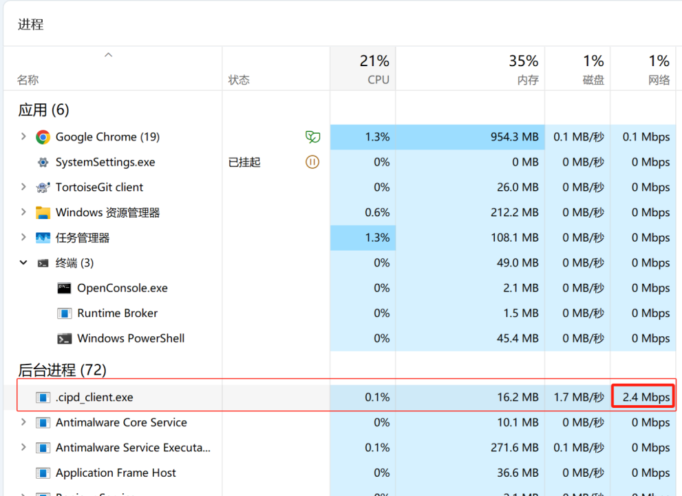
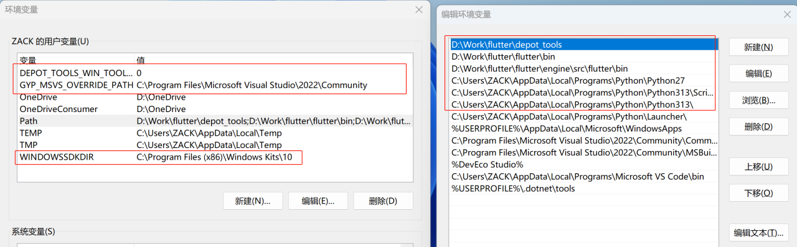

# 让Flutter在Win7上跑起来

## 版本信息

- Flutter源码 commit-id：1d85de0fc802a640dff4fe91697f127d47f8cd21
- Flutter源码版本：3.29.0-1.0.pre.309

## 说明

> 目前最新版 Flutter 并不支持 win7，可以修改引擎源码重新编译以支持 win7 系统。读者需要已在 Windows 电脑配置过 Flutter 开发环境，并且已经可以正常进行 Windows 版 Flutter 应用开发。

> Flutter 代码拉取过程中会进行复杂的文件下载，涉及多种联网方式，所以请保证自己的电脑有稳定的科学上网(翻墙工具建议使用 tun 隧道模式)，如果代码拉取过程中卡在了某一步，请检查网络。

Flutter 引擎编译过程中大约需要 50G 的磁盘空间，可能耗时几个小时，请保证磁盘空间与耐心充足。

`好的，我们开始。`

## 环境准备

- 1.编译的机器使用 win10 或 win11 的64位系统。
- 2.确保计算机上启用了长路径支持。以管理员身份启动 PowerShell 并执行：

```bash
Set-ItemProperty -Path "HKLM:\SYSTEM\CurrentControlSet\Control\FileSystem" -Name "LongPathsEnabled" -Value 1 -Force
```

- 3.安装 Python3，保证 `python3` 命令可以正常使用。
- 4.添加以下环境变量(注意根据实际vs安装情况配置变量)

```bash
DEPOT_TOOLS_WIN_TOOLCHAIN=0
GYP_MSVS_OVERRIDE_PATH=C:\Program Files\Microsoft Visual Studio\2022\Community
WINDOWSSDKDIR="C:\Program Files (x86)\Windows Kits\10"
```

## 代码拉取

###  1.执行命令拉取 `depot_tools`

```
git clone https://chromium.googlesource.com/chromium/tools/depot_tools.git
```

###  2.拉取完成后，将 depot_tools 目录加入系统环境变量 Path

### 3.执行命令拉取 Flutter 代码

```
git clone https://github.com/flutter/flutter.git
```

###  4.拉取 Flutter 依赖

- 4.1进入刚拉取的 Flutter 代码根目录

```
cd .\flutter\
```

- 4.2复制gclient脚本

```
copy .\engine\scripts\standard.gclient .gclient
```
- 4.3 拉取代码与依赖库，注意下面命令使用管理员权限运行

```bash
gclient sync
```

> 这个过程耗时较久，可能下载超过10G的代码与依赖文件。如果中途因网络原因执行失败，可尝试重新执行命令，继续拉取。

> 需要注意的是，命令可能卡在 Syncing projects: 100% (n/n), done. 这一步很久，虽然输出信息没有变化，但实际后台在使用cpid拉取大文件，请耐心等待。



> 可观察任务管理器中的网络信息确认下载情况，如果确实是命令行卡住(没有网络连接)了，请检查科学上网后重试。

> 如果遇到权限导致文件读写失败的问题，可关闭命令行窗口，然后重新启动一个管理员权限命令行窗口，重新执行命令

### 5.将拉取后代码的 `flutter\bin` 目录与 `flutter\engine\src\flutter\bin` 目录加入系统变量 Path（如果已经设置过 `flutter\bin` 目录，请先移除）。

注意几个新加的环境变量 Path 路径位于其他路径之前。



## 代码修改

> 这一步的修改可让 Flutter 支持 win7。

下载附件里的几个 diff 文件，将 flutter_01.diff 复制到 flutter 源码根目录，执行命令

```bash
git apply flutter_01.diff
```

将另外三个 diff 文件复制到 `\flutter\engine\src\flutter\third_party\dart` 目录，并依次执行 `git apply` 命令。

```bash
git apply dart_01.diff
git apply dart_02.diff
git apply dart_03.diff
```

## 开始编译

1.关闭命令行窗口，然后再次使用管理员权限启动命令行，定位到拉取的代码 `flutter\engine\src` 目录下。

2.执行命令

```bash
et build --config host_release
```

`host_release` 表示编译 release 版本，可使用 `host_profile` 和 `host_release` 编译其他版本。

注意这个 `et` 命令实际是 `gn` 命令与 `ninja` 命令的组合，更详细的参数配置可使用 `gn` 与 `ninja` 命令执行编译，具体请参考官方文档。

编译完成的产物在 `\flutter\engine\src\out\host_release` 目录下。

## 测试运行

创建新 Flutter 项目，创建完成后实现下面命令，可使用新编译的引擎运行 exe。

```bash
flutter run --release --local-engine-src-path D:\flutter\engine\src\ --local-engine=host_release --local-engine-host=host_release
```

> 注意根据实际 Flutter 源码目录修改命令中的参数。


## 系统兼容说明

编译完成后的程序可在低版本windows系统运行，但需要注意几点:

- 1.不支持 32 位
- 2.需要 win7 系统安装 kb4474419 系统补丁，没有这个补丁的话会启动失败
- 3.win8 系统可能启动黑屏，可以把 d3dcompiler_47.dll (可在企业微信安装目录找)文件放到引擎同目录下。
- 4.win7 下的其他问题，请参考附录链接里的企业微信相关文章。

## 参考文章

- [方文档-配置开发环境](https://github.com/flutter/flutter/blob/master/engine/src/flutter/docs/contributing/Setting-up-the-Engine-development-environment.md)
- [官方文档-编译引擎](https://github.com/flutter/flutter/blob/master/engine/src/flutter/docs/contributing/Compiling-the-engine.md)
- [官方文档-et编译工具](https://github.com/flutter/flutter/tree/master/engine/src/flutter/tools/engine_tool)
- [官方文档-调试引擎](https://github.com/flutter/flutter/blob/master/engine/src/flutter/docs/Debugging-the-engine.md)
- [RustDesk：如何修改最新 Flutter，让其支持 Windows 7](https://zhuanlan.zhihu.com/p/10307947656)
- [企业微信Flutter与大型Native工程跨四端融合实践](https://cloud.tencent.com/developer/article/2216321)
- [钉钉 Flutter 跨四端方案设计与技术实践 | Dutter](https://my.oschina.net/alimobile/blog/5525030)


## 附件

- [flutter_01.diff](https://gitee.com/zacks/awesome-harmonyos-flutter/blob/master/FlutterWin7/patch/flutter_01.diff)
- [dart_01.diff](https://gitee.com/zacks/awesome-harmonyos-flutter/blob/master/FlutterWin7/patch/dart_01.diff)
- [dart_02.diff](https://gitee.com/zacks/awesome-harmonyos-flutter/blob/master/FlutterWin7/patch/dart_02.diff)
- [dart_03.diff](https://gitee.com/zacks/awesome-harmonyos-flutter/blob/master/FlutterWin7/patch/dart_03.diff)


