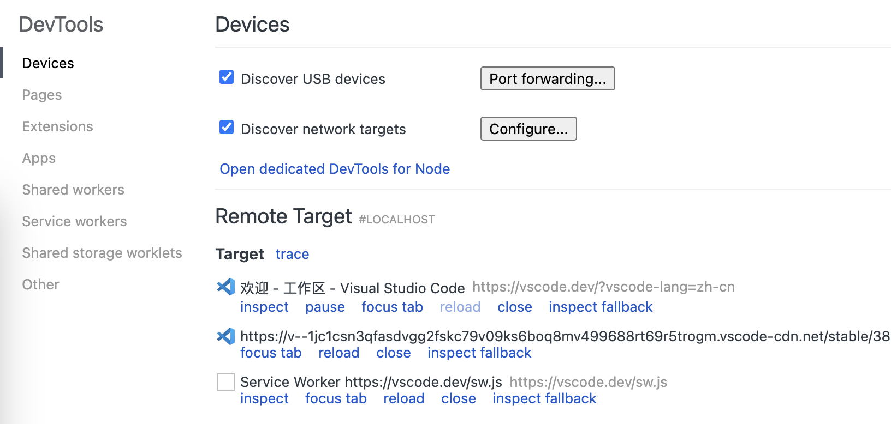

# 鸿蒙 Flutter 如何使用 DevTools 调度 Webview

在《鸿蒙 Flutter 开发中集成 Webview》，介绍了如果在 Flutter 中集成 Webview. 本文则为 Webview 的调试方法。

## 配置 Webview

CustomView.ets 文件中，在生命周期aboutToAppear处配置允许调试：

```ets
  aboutToAppear() {
    webview.WebviewController.setWebDebuggingAccess(true);
  }
```

## 找到 devtools 的端口

运行 App，使用 hdc 命令连接设备，查找相关端口

```bash
# 连接设备
hdc shell

# 找到相关进程
cat /proc/net/unix | grep devtools

#0: 00000002 0 10000 1 1 2318187 @webview_devtools_remote_43406
#0: 00000002 0 10000 1 1 20785 @webview_devtools_remote_6312
```

如上面所示，webview_devtools_remote_43406 即为我们要调试的页面

## 开启端口转发

将设备中的端口转发到开发电脑上

```bash
hdc fport tcp:9222 localabstract:webview_devtools_remote_43406

# Forwardport result:OK
```

## 在 Chrome 中找打 Webview 并开始调度

在 Chrome 中打开 `chrome://inspect/#devices`页面，观察页面中RemoteTarget 处出现了相关页面

选择需要调度的页面，点击 **inspect**，弹出 DevTools 窗口，开启页面调度



## 其他

如果要在 Webview 注入 js 代码，可在 Web 组件配置处使用`runJavaScript`方法注入 JavaScript 脚本，如

```ets
    Web({src: 'https://baidu.com', controller: this.webviewController})
      .domStorageAccess(true)
      .fileAccess(true)
      .mixedMode(MixedMode.All)
      .databaseAccess(true)
      .javaScriptAccess(true)
      .onPageEnd(() => {
          this.webviewController.runJavaScript("document.querySelector('meta[http-equiv=\"Content-Security-Policy\"]').remove()");
      })
```

## 参考资料

- [ArkWeb API](https://developer.huawei.com/consumer/cn/doc/harmonyos-references-V5/arkweb-api-V5)
- [ArkWeb介绍](https://developer.huawei.com/consumer/cn/doc/harmonyos-guides-V5/arkweb-V5)
