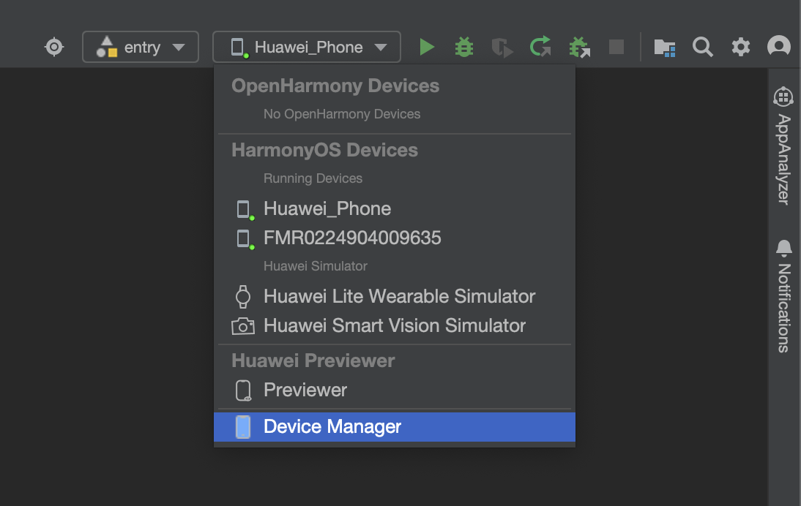
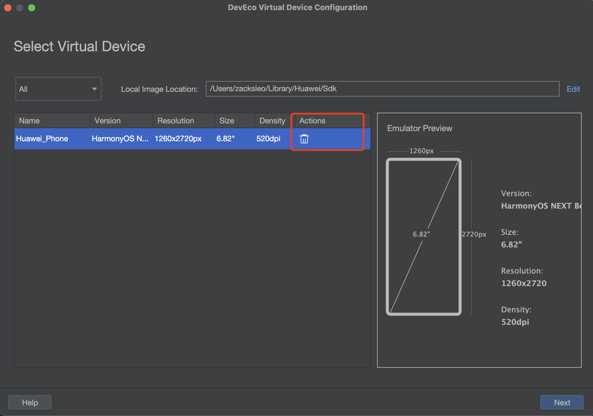

# 鸿蒙 Flutter 实战：使用模拟器开发调试

## SDK 选择前

- ohos-3.7, 可以使用 X86 模拟器
- ohos-3.22, 需要使用 ARM 架构 MAC 电脑的模拟器

## 创建项目

等开发环境搭建成功，使用 flutter create 命令创建项目

### 新项目

```bash
flutter create --platforms ohos ohos_app
```

### 旧项目增加鸿蒙平台支持

```bash
flutter create --platforms ohos .
```

## 签名

使用 DevEco 打开上面项目中的 ohos 目录，也就是我们的鸿蒙项目目录

打开 `File` -> `Project Structure...`, 点击 `Siging Configs`, 勾选 Automatically generate signature,

点击 `Sign In`, 登录华为账号，点击右下角 `Apply`, `OK`, 完成签名。

观察控制台会输出 `Process finished with exit code 0`的提示

```bash
> hvigor WARN: The current module 'ohos' has dependency which is not installed at its oh-package.json5.
> hvigor Finished :entry:init... after 1 ms
> hvigor Finished ::init... after 1 ms

Process finished with exit code 0
```

## 创建模拟器

1.打开 DevEco 中的 Device Manager（可以从右上角的运行按钮左侧下拉找到）



2.在右下角点击 `+ New Emulator`, 弹出选择模拟器窗口，如果镜像还没有下载，方框处会出现下载按钮，先点击下载，下载完成后点击 `Next` 创建模拟器，再点击 `Previous` 创建成功



3.回到模拟器列表窗口，列表中出现了新建的模拟器，点击`运行`按钮, 模拟器运行成功。

## 运动 Flutter 项目

Vscode中右下角应当出现模拟器的设备，行如 `127.0.0.1:5555(ohos-arm64)`, 如果没有出现参考注意事项中的说明 2 操作。

回到 Vscode 中的Flutter 项目，像普通的 flutter 项目那行，点击运行按钮。

## 注意事项

### 1. Flutter 运行 App，打包安装成功， 运行闪退 从以下方面检查：

1.1 如果是 X86电脑架构的模拟器，尝试删除 main.dart 中的 FloatingActionButton
1.2 如果 Flutter SDK 使用的 ohos-3.22, 尝试关闭 `impeller` 渲染方式，打开或创建文件 `ohos/entry/src/main/resources/rawfile/buildinfo.json5`, 增加以下配置

```json
{
   "string": [
      {
         "name": "enable_impeller",
         "value": "true"
      }
   ]
}
```

### 2.VSCode 中模拟器设备不显示

2.1 尝试使用 Deveco 打开项目的 ohos 目录（即鸿蒙项目文件），等待初始化分析成功
2.2 尝试重启 VSCode

3.使用 fvm 时，项目目录下 flutter --version 显示不正确，不是 ohos 版本

以次按以下的方式进行逐个尝试，直至成功。

3.1 尝试在 vscode 的命令行中运行 `fvm use custom_3.22.0`, 待命令创建 .vscode/setting.json 文件并在其中增加类似这样的配置

```json
{
  "dart.flutterSdkPath": ".fvm/versions/custom_3.22.0"
}
```

项目根目录中出现 .fvm/version/custom_3.22.0 这样的目录文件，项目根目录出现 `.fvmrc` 文件，其内容类似如下

```json
{
  "flutter": "custom_3.22.0"
}
```

3.2 尝试重启 VsCode 的命令行，或者重启整个 VsCode，待重新打开 VSCode 命令行以后，`flutter --version` 出现这样的输出

```bash
Flutter 3.22.0-ohos • channel oh-3.22.0 • https://gitcode.com/openharmony-tpc/flutter_flutter.git
Framework • revision 85630b0330 (13 天前) • 2024-10-26 02:39:47 +0000
Engine • revision f6344b75dc
Tools • Dart 3.4.0 • DevTools 2.34.1
```

3.3 关闭全局 flutter 配置

在 `~/.zshrc` 或 `~/.bash_profile`中，删除或者注释掉类似这样的配置，重启命令行/VSCode

```bash
#export PATH="/Users/zacksleo/flutter/bin:$PATH"
```
