# 鸿蒙应用打包上架流程

## 创建应用

### 新建项目

1.在 AppGalleryConnect，我的项目，添加项目。

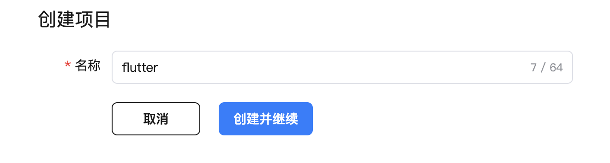

### 新建APP ID

1.在 AppGalleryConnect，证书、APP ID 和 Profile 中。

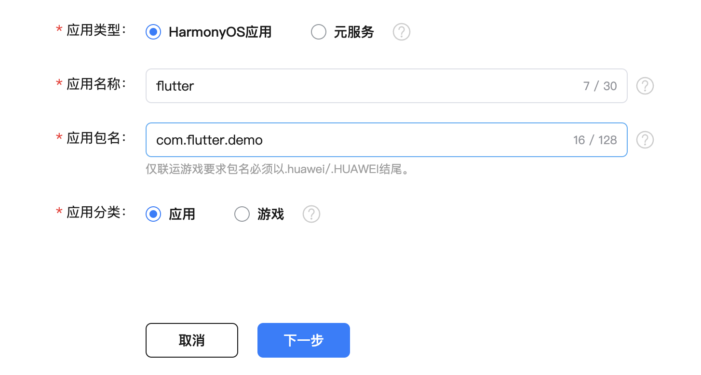

选择所属项目


### 新建应用/元服务

在 APP ID 右侧，点击`发布`, 会弹出发布 HarmonyOS应用/元服务

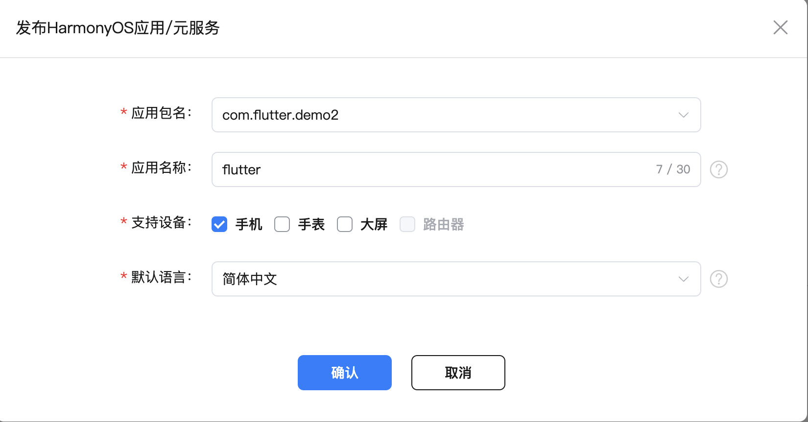

按提示填写应用信息，上传应用图标，选择应用分类、标签，点击下一步

上传打包 App（见下方）。

填写应用信息，公司信息等。需要注意的是，App 需要提供软著，元服务则不需要。

## 打包签名

### 自动签名

如果是开发和测试，可以使用自动签名。(File -> Project Structure -> Signing Configs 勾选 Automatically generate signature)

### 如果是打包上架，则需要手动签名

#### 打开Deveco，依次执行以下操作

1. 在主菜单栏单击 Build > Generate Key and CSR

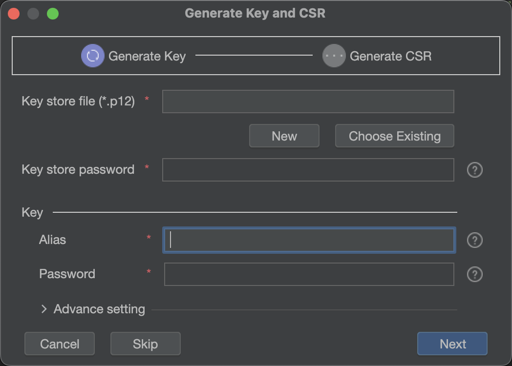

2.如果没有创建 Key Store，则点击 New 创建一个

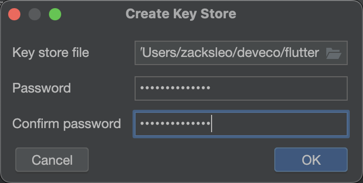

选择需要存储的目录（文件扩展名使用.p12），输入密码8位以上的复杂密码，点击 OK。

3.设置 Key 的别名

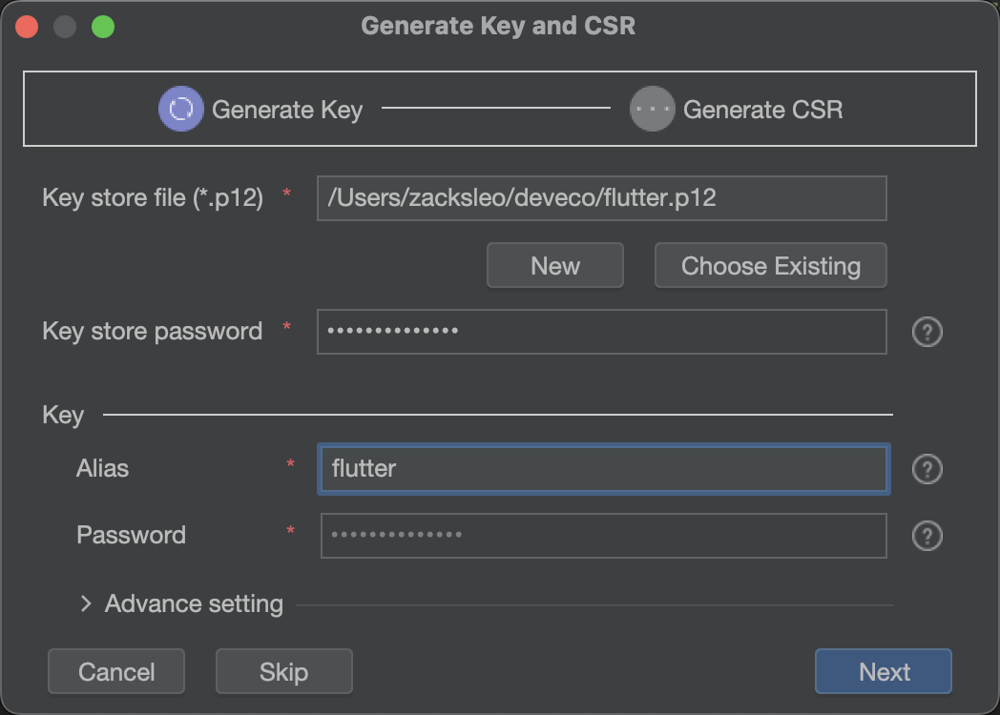

点击 Next 进入下一步

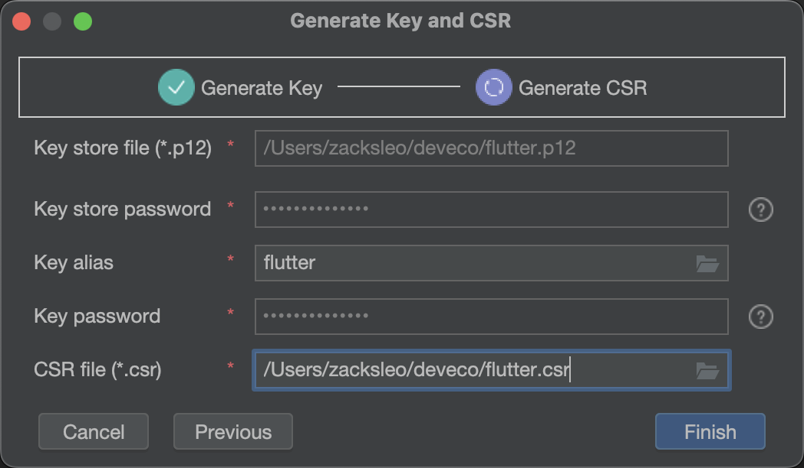

设置 CSR 存储位置，注意文件名需要用 `.csr` 做为扩展名。

点击 Finished, 会创建 `.p12`密钥库文件以及 证书请求`.csr` 等文件。

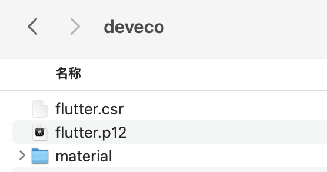

#### 登录 [AppGallery Connect](https://developer.huawei.com/consumer/cn/service/josp/agc/handleAllianceLogin.html?_=20241104164846), 执行以下操作

1.点击 `证书、App ID 和 Profile`，在`证书`一栏，点击“新增证书”，上传上面创建的 CSR 文件，将生成 `cer` 文件，

点击下载按钮，将该证书文件保存，待 APP 打包使用。

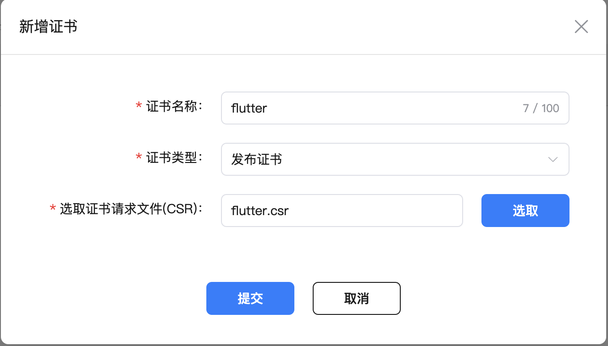

2.`证书、App ID 和 Profile` 中的 `Profile`一栏，点击添加，创建 Profile 文件，选择刚才创建的证书

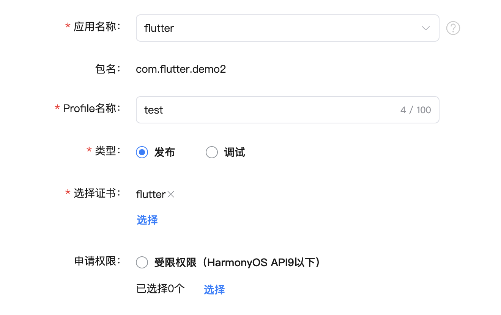

### 打包 App

在 Deveco中，打开 File -> Project Structure -> Signing Configs, 默认会有一个创建过的 default 签名配置，点击 + 添加按钮，

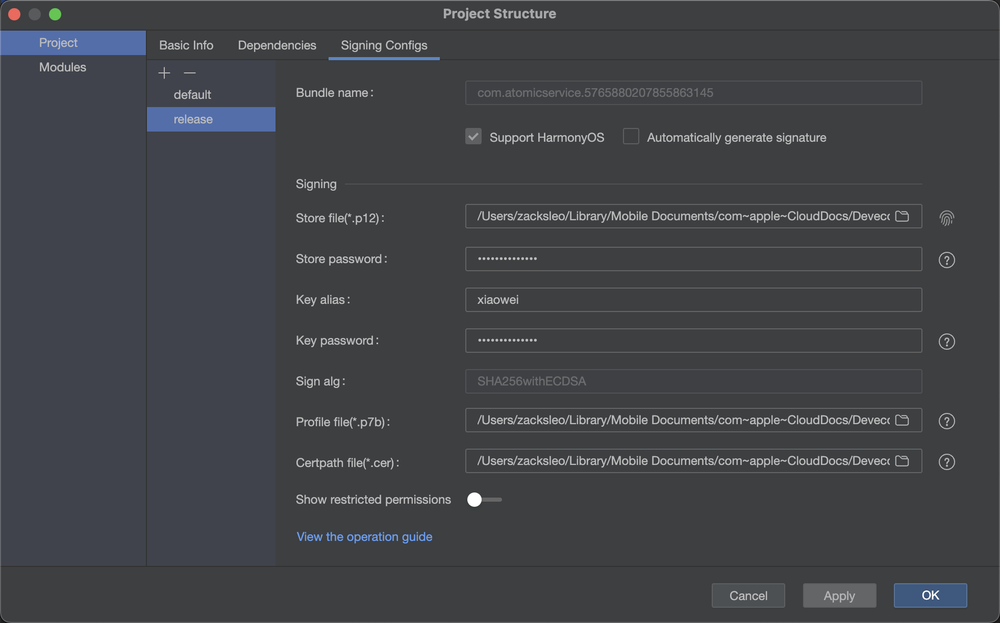

以此选择上面创建的 .p12文件、.p7b文件，以及下载的 .cer 文件，输入密码, 点击 `Apply` 生成配置。

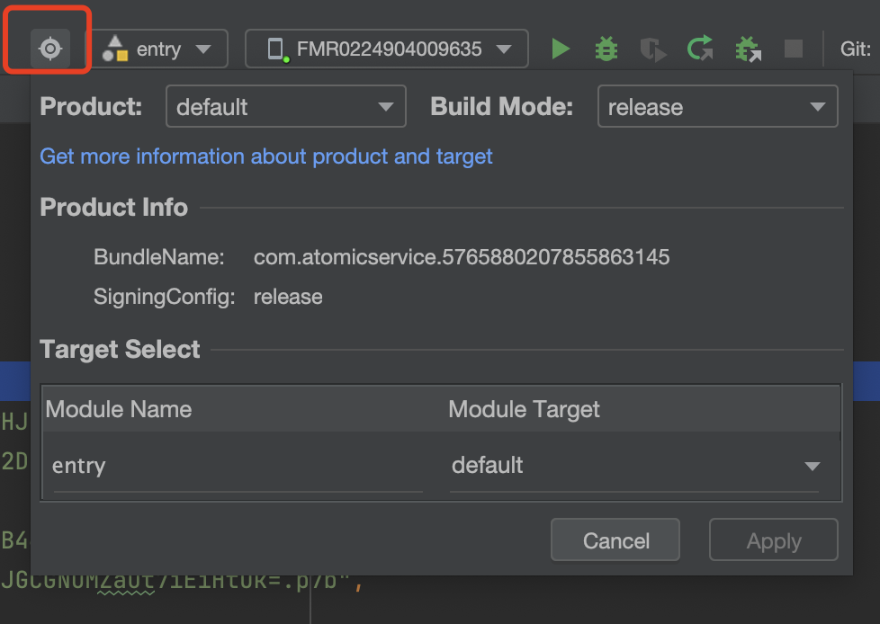

点击红框处的 `Product` 🔘 按钮，Build model 选择 release, 同时 build-profile.json5 文件中配置使用哪个签名

```json
    "products": [
      {
        "name": "default",
        "signingConfig": "release",
      }
    ]
```

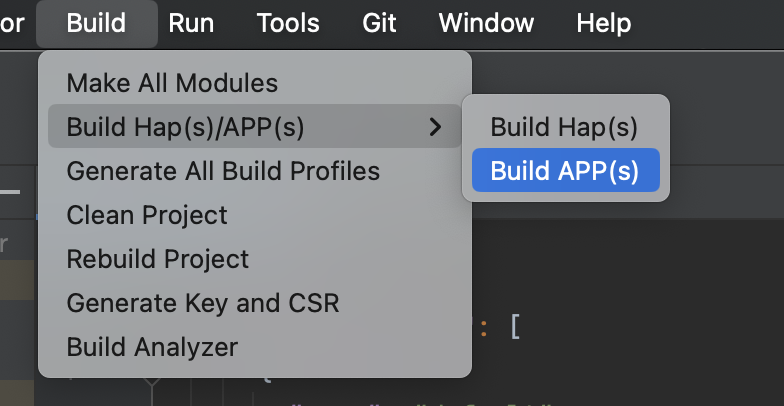

点击 Build-> Build Hap(s)/APP(s), 选择 Build APP(s), 开始 APP 打包。

打包成功后，会在项目根目录的 build/outputs/default 生成 .app文件，即为我们要在应用市场上传的文件包

## 常见问题

`软件包解析失败，详细信息点击软件包管理列表中的错误码查看，请按照指导重新打包上传。`
`993，Profile文件非法`

检查签名配置文件，是否使用是 release 配置

build-profile.json5

如下面的配置，这里添加了两个签名配置，一个用于开发调度，一个用于打包上架

```json
    "signingConfigs": [
      {
        "name": "default",
        "type": "HarmonyOS",
        "material": {
          "certpath": "xx",
          "storePassword": "xxx.cert",
          "keyAlias": "debugKey",
          "keyPassword": "xxx",
          "profile": "xxx.p7b",
          "signAlg": "SHA256withECDSA",
          "storeFile": "xxx.p12"
        }
      },
      {
        "name": "release",
        "type": "HarmonyOS",
        "material": {
          "certpath": "xx",
          "storePassword": "xxx.cert",
          "keyAlias": "release",
          "keyPassword": "xxx",
          "profile": "xxx.p7b",
          "signAlg": "SHA256withECDSA",
          "storeFile": "xxx.p12"
        }
      }
    ],
    "products": [
      {
        "name": "default",
        "signingConfig": "release",
        "compatibleSdkVersion": "5.0.0(12)",
        "runtimeOS": "HarmonyOS",
        "buildOption": {
          "strictMode": {
            "caseSensitiveCheck": true,
            "useNormalizedOHMUrl": true
          }
        }
      }
    ],
```

在打包上架时，需要确保上面的 signingConfig 使用的是 name 为 `release`的签名配置

## 参考资料

-[应用/服务签名](https://developer.huawei.com/consumer/cn/doc/harmonyos-guides-V5/ide-signing-V5)
