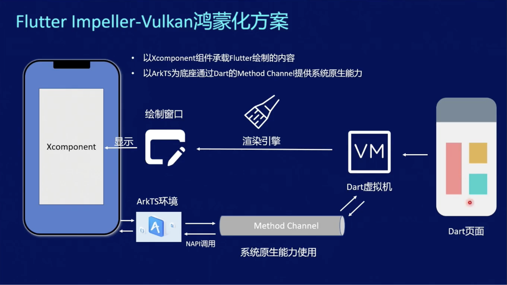
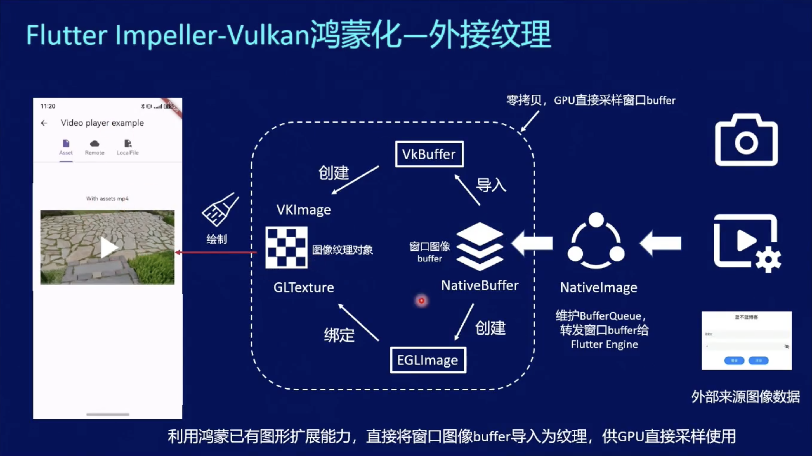
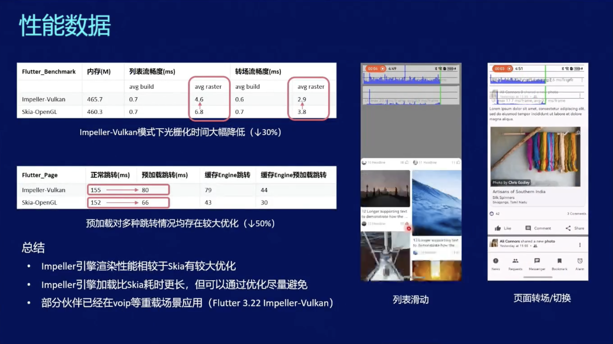

##  Flutter 技术原理

Flutter 是一个主流的跨平台应用开发框架，基于 Dart 语言开发 UI 界面，它将描述界面的 Dart 代码直接编译成机器码，并使用渲染引擎调用 GPU/CPU 渲染。

> 渲染引擎的优势

使用自己的渲染引擎，这也是 Flutter 与其他跨平台框架最大的区别。

与 React Native 等高度依赖原生组件的框架不同，Flutter 摆脱了原生组件依赖，界面布局更加灵活，多端展示效果高度一致。由于渲染引擎自建，性能优化空间更大，这也是为什么Flutter 以流畅著称。

## Impeller 渲染引擎由来

Flutter 的渲染引擎经历了多次迭代，早期全端使用 Skia, 后来为了解决 iOS 上着色器编译卡顿问题，Flutter 团队开发了新一代渲染引擎 Impeller。由于表现优异，Impeller 已经成为 Flutter 未来的发展方向。

> 渲染引擎将着色器编译成GPU指令，也就是二进制代码。

> 着色器是一种图形绘程序，它定义了如何绘制一个图形，比如颜色、形状、变换等。

> Flutter在解决卡顿问题上，基于Skia做了多次努力和尝试，始终不尽人意，最终才有了Impeller。

Impeller 的设计目标包括: 消除首次卡顿、降低帧渲染驱动开销、利用现代 GPU 并行渲染能力

## Impeller 与 Vulkan

Vulkan 是 OpenGL 推出的下一代图形 API，在安卓上，Flutter Impeller 调用 Vulkan 实现界面渲染。

 1. Impeller 实现了常用的着色器，支持参数化，通过预编译色器来避免编译卡顿问题
 2. 分层架构简化了渲染过程，每一层基于下层能力执行特定功能，高效且易用于维护更新
 3. 绘制命令容易聚合，易于拆分和并行
 3. 渲染设计与图形API解耦

##  Impeller 鸿蒙化

Impeller 的鸿蒙化基于 Vulkan, 通过 ArkUI 提供的 XComponent 组件承载 Flutter 视图。

与其他平台一样，通过 Method Channel , Dart 调用 ArkTS 来实现原生能力的调用。

### XComponent 如何承载 Flutter 视图

通过 XComponet 获取到系统底层的 OHNativeWindow 实例, 这个就是鸿蒙的原生窗口，通过鸿蒙提供的扩展 VK_OHOS_surface, 将这个窗口转成一个 Vulkan 中的 VKSurface, 进而通过 VKSwapchain 实现了窗口绘制。

### 外接纹理：系统产生的图形图像如何嵌入 Flutter 显示

借助 XComponent，Flutter 绘制的界面可以显示在鸿蒙中。那么如果是非 Flutter 绘制的界面，如系统相机、视频等，如何嵌入到 Flutter 界面中呢？这就涉及到外接纹理了。

以相机为例，如果在 Flutter 中使用相机，当然最基础的可以通过 Method Channel 通信，将数据传递过来，但这个过程显然非常耗时，性能堪忧。另外一种方案是通过挖孔，叠加系统页面和 Flutter 画面，但这可能带来两套界面的操作、动画不一致问题。鸿蒙化采用了难度更高的数据导入方案，即将外部数据导入到 Flutter，将这些数据以纹理组件形式绘制。

### 鸿蒙化外接纹理涉及编码数据传输，如何解决性能问题

NativeBuffer 由鸿蒙提供, 通过它可以实现内存共享。那么外部导入的数据，通过 NativeBuffer，可以直接让 GPU 使用，避免了因数据拷贝造成的性能损失。

无论是 VKImage， 还是 GLTexture，都可以使用 NativeBuffer。

### 如何解决花屏问题

与安卓不同，Impeller 鸿蒙化方案采用了 GPU 硬件级的同步机制，保护数据读取，防止数据竞争，避免图像的花屏，通过 CPU 解耦，减少了空转时间，提高了性能。

Flutter 引擎侧不需要等待 Buffer 读写完成再调用绘制能力，只要保证 GPU 在绘制队列时，涉及 Buffer 数据的信号量状态为已读取即可，减少了 CPU 空等时间造成的性能损失。

## 渲染管线预加载

Impeller 通过预编译着色器避免了 Skia 中的运行时编译，但启动时需要加载这些着色器（也就是加载渲染管线），这就会出现明显的白屏时间。要解决这一问题，那就需要预加载渲染管线。

鸿蒙 Flutter 在运行时，首先创建 Dart 虚拟机解析 UI，在这个过程中同步进行渲染管线加载，从而实现首帧快速上屏，时延降低 50ms。

> 这部分不需要开发者操作，SDK 会自动完成。

## 混合开发加载优化：页面预加载

从原生 ArkUI 页面跳转到 Fluter 页面，需要先初始化 Flutter 引擎（这个过程耗时较长），再渲染首帧页面，这就会出现明显卡顿。

开发者可以提前手动调用 Flutter 引擎初始化 API，来解决这一卡顿问题。例如用户在触摸发生时，同步初始化 Flutter 引擎，等到用户抬手以后，就可以立即跳转到 Flutter 页面，整个过程会更加流程。

## 性能测试

通过预加载，可以节省一半的跳转时间。与 Skia 方案相比，Impeller 的转场流畅度提升显著。

与 Skia 方案相比，Impeller 方案在性能上表现更好。

## 鸿蒙 Flutter 的未来

鸿蒙 Flutter 适配团华为主导，计划每年推出 1-2 个比较大的版本，这两个大版本通过 fork 官方当时的主要版本来实现。至于能否将鸿蒙适配的部分合并到 Flutter 官方，还要看 Google 的态度。

> 结合前段时间 Flutter 社区版本 Flock 的推出，笔者持乐观态度。虽然 Google 在 Flutter 更新这方面进度缓慢，但社区版本带来不少想象力。多个 SDK 版本并存并不意味着分裂，竞争带来更多的活力。这点可以参考 Java，除了甲骨文主导的 OracleJDK, 还有 OpenJDK, AdoptOpenJDK 等十几种社区版本。

除了已有的插件开发方式，鸿蒙 Flutter 计划推出一种成本更低的方案，即通过一种统一接口描述，自动生成各端调用代码，省去开发者的编码工作。

## 总结

Flutter 作为一种流行的跨平台框架，支持鸿蒙是大势所趋。华为躬身入局，为 Flutter 社区带来了强劲动力。

> 从目前各方反馈来看，Flutter 应该是仅次于 ArkTs 的最佳适配方案。
不论是官方、还是开源社区、亦或是广大的开发者，都对 Flutter 有着强烈的诉求。
HarmonyOS 希望更多应用尽快适配鸿蒙，开发者或者是厂商，也希望以更低的成本最快上架；ArkTS 仍然有不少需要改进之处，就拿热重载一项与之对比，Flutter 不论从易用性、稳定性和成熟度已经遥遥领先。

> 对于平台独有的特性，如鸿蒙中的各种 Picker 组件、免权限按钮等，这与在其他平台上一样，是属于原生语言独有的优势所在。

虽然 Flutter 鸿蒙化已经初见成效，不少三方 Flutter 应用也快速适配上架，但生态建设仍需诸多时间，三方库还需要共建共享。

鸿蒙未来可期，Flutter 的鸿蒙化，为这个沉寂许久的框架，带来了新鲜血液。

## 参考资料

- [Flutter lmpeller鸿蒙化实践 (第一期)](https://b23.tv/KKNDAQB)
- [Flutter 新一代图形渲染器 Impeller](https://mp.weixin.qq.com/s/PLvlSt3tlX6AjufDm0XVMA)
- [Understanding Impeller: A Deep Dive into Flutter’s Rendering Engine](https://blog.stackademic.com/understanding-impeller-a-deep-dive-into-flutters-rendering-engine-ba96db0c9614)
- [Flock](https://getflocked.dev/)
- [鸿蒙 Flutter 实战](https://gitee.com/zacks/awesome-harmonyos-flutter)
