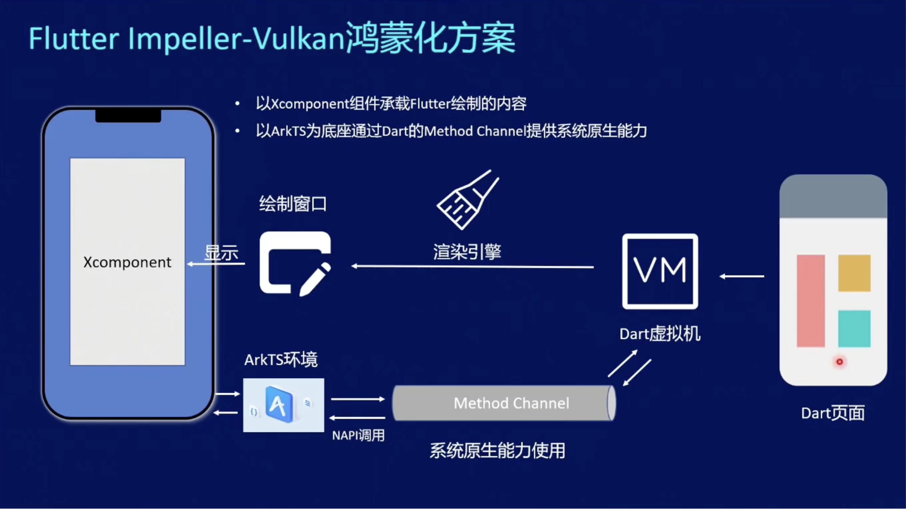
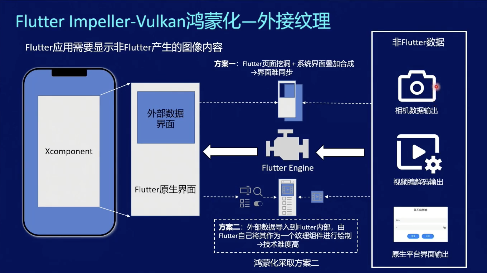
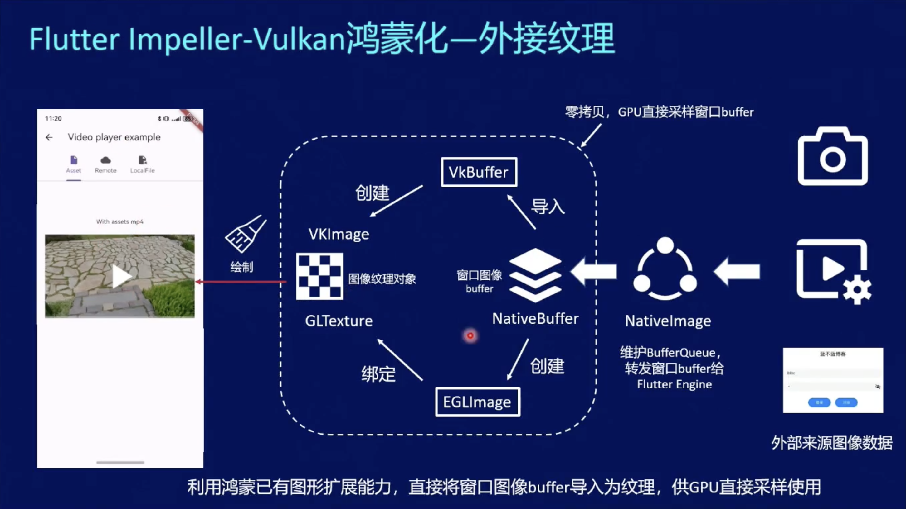
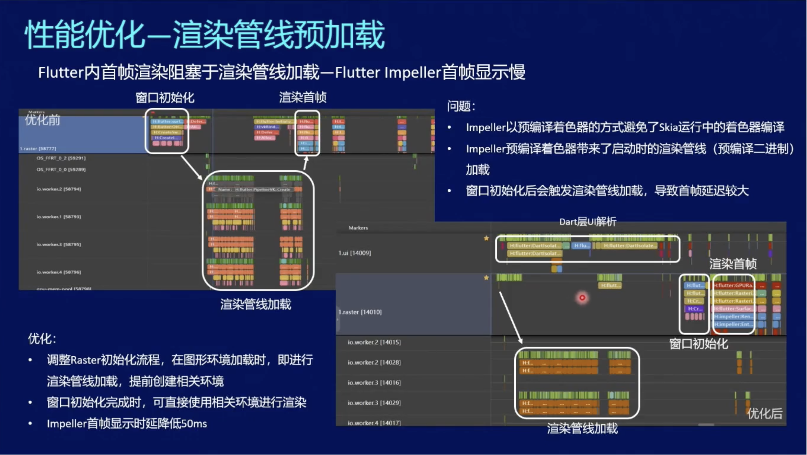
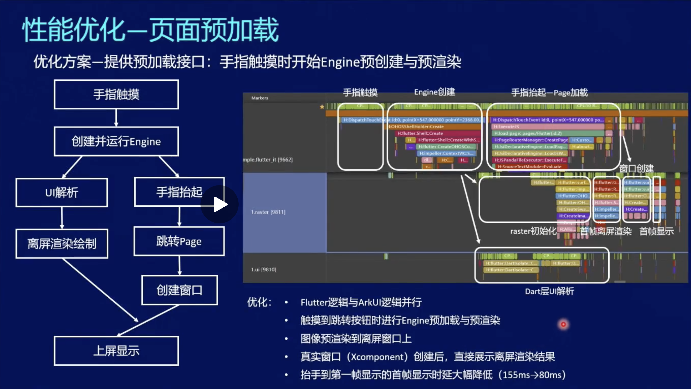
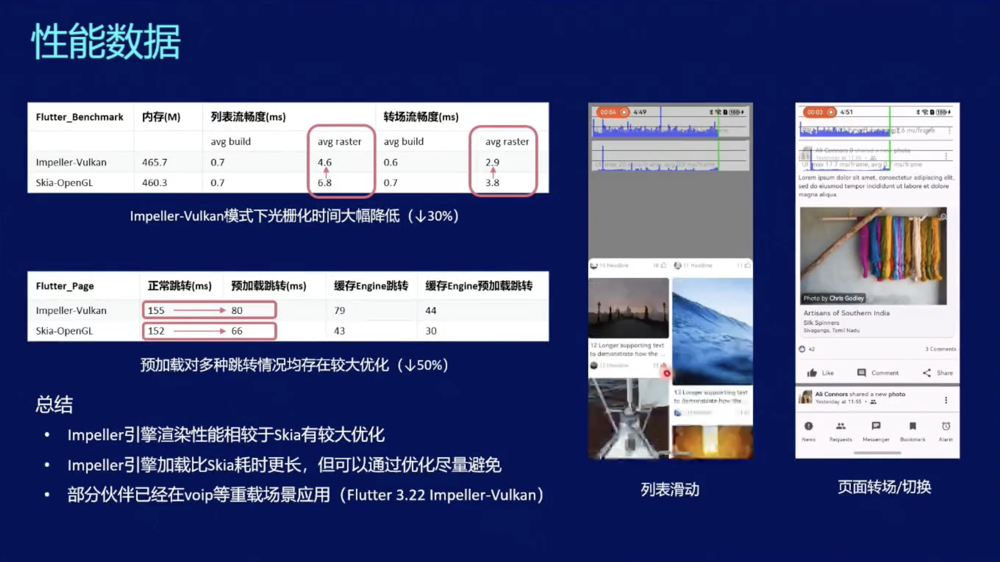

##  Flutter 原理

Flutter 是一个跨平台应用开发框架，基于 Dart 语言开发 UI 界面，将绘制界面的 Dart 代码直接编译成机器码，并使用自绘引擎调用 GPU/CPU 渲染。

Flutter 使用自己的渲染引擎，这也是它与其他跨平台框架最大的区别。像 React Native 等框架，高度依赖系统原生组件，Flutter 更近一步，摆脱原生组件依赖，在界面布局上更加灵活，同时带来了极高的多端一致性。

