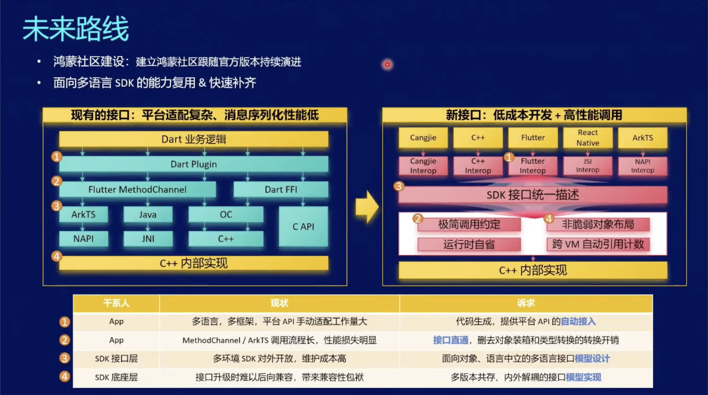

##  Flutter 原理

Flutter 是一个主流的跨平台应用开发框架，基于 Dart 语言开发 UI 界面，它将描述界面的 Dart 代码直接编译成机器码，并使用渲染引擎调用 GPU/CPU 渲染。

### 渲染引擎的优势

使用渲染引擎，这也是 Flutter 与其他跨平台框架最大的区别。

像 React Native 等框架，高度依赖系统原生组件。Flutter 摆脱了原生组件依赖，界面布局更加灵活，多端展示效果高度一致。由于渲染引擎自建，性能优化空间也大，Flutter 以流畅著称。

Flutter 的渲染引擎经历了多次迭代，早期全端使用 Skia, 为了解决着色器编译卡顿问题，iOS和安卓移动端开始引入 Impeller。由于表现优异，Impeller 已经成为 Flutter 渲染引擎未来的发展方向。

