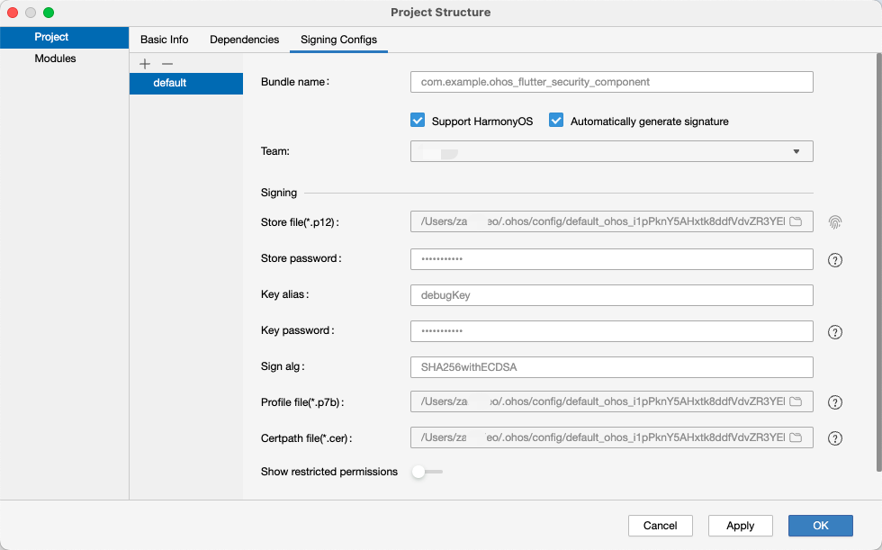
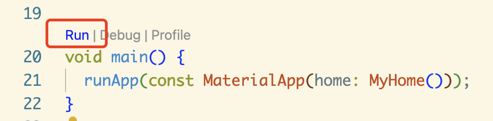

> 本文讲述如何通过Flutter开发鸿蒙原生应用。整个过程结合往期文章、实战经验、流程优化，体验丝滑、无痛。

## 无痛搭建开发环境

> 为了减少疼痛，这里使用全局唯一的Flutter版本开发。高阶用法可以参看往期同系列文章。

### 硬件准备

一台 Mac，一部 Mate60 Pro，两台显示器。

> 鸿蒙Flutter SDK 开发人员爱用 Mac，使用相同设备（优先选择Arm版Mac，X86也可以，系统不要太老）无忧。

> 审核人员爱用Mate60系列，选择同款无忧。

> 显示器两台，左侧放别人的代码，右侧是自己的，方便参考（复制粘贴）。

## 环境准备

### 下载 DeEco
进入华为开发者联盟网站，https://developer.huawei.com/consumer/cn/download/，根据电脑机型点击下载。

### 下载 Flutter SDK

```bash
# 创建目录 ~/.fvm/versions
mkdir -p ~/.fvm/versions

# 克隆 Flutter SDK
git clone https://gitee.com/harmonycommando_flutter/flutter.git custom_3.22.0
```
### 配置环境变量

打开 `~/.bash_profile`，增加以下内容

```bash
# Flutter Mirror
export PUB_HOSTED_URL=https://pub.flutter-io.cn
export FLUTTER_STORAGE_BASE_URL=https://storage.flutter-io.cn

# HarmonyOS SDK
export TOOL_HOME=/Applications/DevEco-Studio.app/Contents/
export DEVECO_SDK_HOME=$TOOL_HOME/sdk # command-line-tools/sdk
export PATH=$TOOL_HOME/tools/ohpm/bin:$PATH # command-line-tools/ohpm/bin
export PATH=$TOOL_HOME/tools/hvigor/bin:$PATH # command-line-tools/hvigor/bin
export PATH=$TOOL_HOME/tools/node/bin:$PATH # command-line-tools/tool/node/bin

export PATH="~/.fvm/versions/custom_3.22.0/bin:$PATH"
```

配置完成以后，关闭命令行工具，并重新打开，使之生效。使用 `flutter doctor` 命令查看是否有 `3.22.0-ohos` 字样。

## 创建项目

使用以下命令创建项目

```bash
flutter create --platforms ohos .
```

## 配置自动签名

使用 Deveco 打开项目，Mate60 Pro 手机连上电脑（必须）。

打开 `File -> Project Structure -> Signing Configs` 勾选 `Automatically generate signature`。

点击 `Apply` 应用，`OK` 完成签名。此时可关闭 DevEco。



## 运行项目

1. 使用 Flutter run 命令，或者在 IDE 中，点击运行按钮

```bash
# 查看设备编号
futter devices
```

出现以下类似输出

```bash
  Found 3 connected devices:
  FMR0224904009635 (mobile) • FMR0224904009635 • ohos-arm64     • Ohos OpenHarmony-5.0.1.115 (API 13)
  macOS (desktop)           • macos            • darwin-x64     • macOS 14.6.1 23G93 darwin-x64
  Chrome (web)              • chrome           • web-javascript • Google Chrome 131.0.6778.108
```

找到鸿蒙设备的 ID，如上所示为 FMR0224904009635。

```bash
# 运行
flutter run -d FMR0224904009635
```

2. 在 IDE 中，点击运行按钮，以下是 VsCode 中的入口

> 确保安装了 Code Runner 插件



