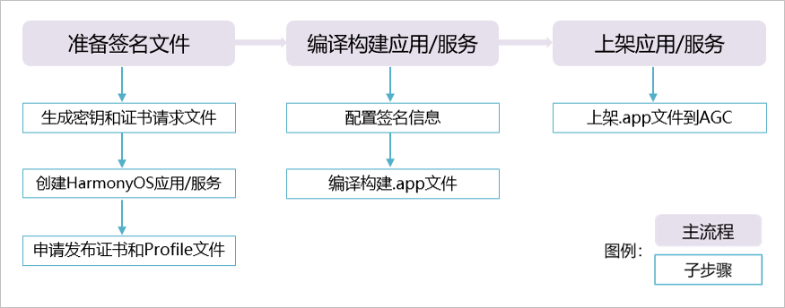
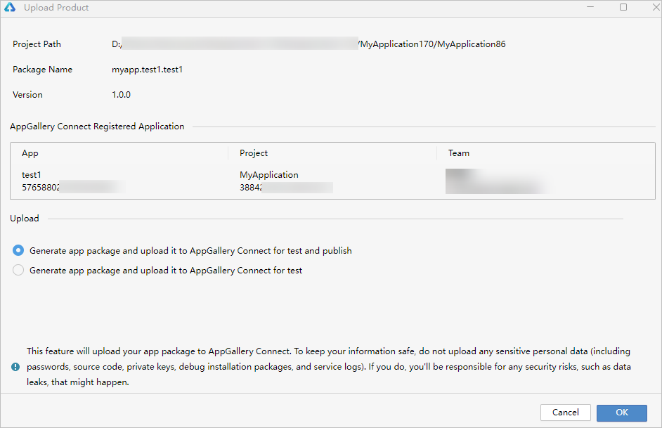

> 在上期文章中，我们体验了无痛使用 Flutter 快速启动开发的过程，本期重点聚焦上架审核流程。

## 无痛打包

提前准备好生产证书。

> 具体步骤见“鸿蒙Flutter实战：13-鸿蒙应用打包上架流程”，在AGC平台证书栏，“新增证书”成功后，点击现在，得到一个xx.cer文件（数字证书文件）；在Profile一栏，添加完之后，点击现在可以得到一个xx.p7b文件（Profile文件）。这两个文件将会在手动签名时使用。

使用最新的 IDE 自动上传功能。

> DevEco Studio菜单栏，点击Build > Upload Product，登录开发者账号，进入上传界面。

> 选择 Generate app package and upload it to AppGallery Connect for test and publish。

## 无痛审核

> 审核实际上是一直非常重要的过程，不要以为开发完、打包上传就结束了，App Gallery 的审核十分严格，提前做好心理准备。

> 对于新应用，首次上架相对友好宽松，但也要明确没有明显问题，符合大致要求，不要存在侥幸心理。

### 名称

名字要确保唯一，提前在商城搜索，另外不要使用容易误解、太通用的的名称，如“文件管理”，“二维码生成”，建议增加品牌前缀，如有商标版权更加无痛。

### 图标

按规范设计，不要和系统图标相似，不要和其他应用雷同。

### 备案

提前对域名、App进行备案，应用名称、包名确保一一对应。

### 软著

使用电子软著，或者直接找中介全包，只需要提供名字等基础信息即可，全程无痛。

软著中的名称或简称要与App名称对应。

### 充分测试

确保充分测试，如果分发平台选择了平板，确保在平板上测试。

### 录制测试视频

审核人员测试很仔细，会帮你找bug，所以有测试视频也挺重要。
如果不具备平板测试条件，建议后期更新版本再勾选。上架只关注手机更无痛。

### 备注说明

如果应用有些特殊的设计理念，需要备注说明。不要指望审核人员能轻松理解你的意图。

### 测试账号

如果设计登录功能，最好提供一个可以正常使用的、甚至是有数据的测试账号，让审核人员也无痛。

### 提交时间

提前提交，避开周六。建议提交时间为周日-周四的每个晚上 。提交以后不要撤回，不然要重新排队。

## 参考资料

- [鸿蒙Flutter实战：13-鸿蒙应用打包上架流程](./鸿蒙Flutter实战：13-鸿蒙应用打包上架流程.md)
- [鸿蒙Flutter实战：16-无痛开发指南（适合新手）](./鸿蒙Flutter实战：16-无痛开发指南（适合新手）.md)
- [HarmonyOS应用/元服务发布](https://developer.huawei.com/consumer/cn/doc/harmonyos-guides-V13/ide-publish-app-V13)
