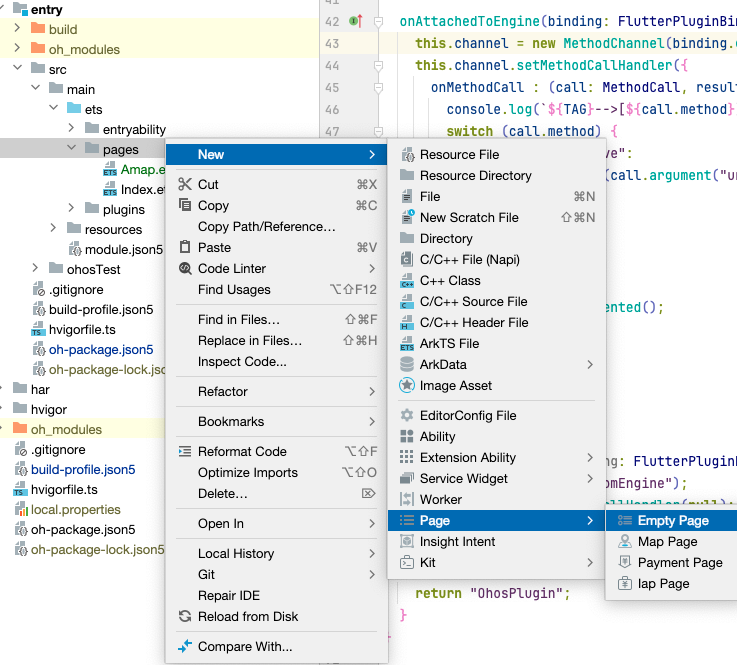

## 前言

在之前的文章[现有Flutter项目支持鸿蒙II](https://gitee.com/zacks/flutter-ohos-demo)中，介绍了如果使用第三方插件，同时给出了非常多的使用案例，如
flutter_inappwebview，video_player, image_picker 等，本文将开始介绍如何集成高德地图。

## 整体方案

通过 MethodChannel 进行消息通信，在 Dart 侧调用原生API，在 ArkTS 侧收到相关调用后，根据参数跳转到指定页面

## Dart 侧

```dart
  static Future<dynamic> redirectNative(String url) {
    return _methodChannel.invokeMethod("redirectNative", {
      "url": url,
    });
  }
```

## ArkTS 侧

在 `ohos/entry/src/main/ets/entryability` 创建 `OhosPlugin.ets` 文件,这里收到到消息后，调用 `router.pushUrl` 方法跳转到指定页面

```ts
export default class OhosPlugin implements FlutterPlugin {
  ...
  onAttachedToEngine(binding: FlutterPluginBinding): void {
    this.channel.setMethodCallHandler({
      onMethodCall : (call: MethodCall, result: MethodResult) => {
        switch (call.method) {
          case "redirectNative":
            let url = String(call.argument("url"));
            router.pushUrl({ url: url})
            break;
          default:
            result.notImplemented();
            break;
        }
      }
    })
  }
}
```

插件写好后，需要在 EntryAbility 中注册:

```ts
this.addPlugin(new OhosPlugin())
```

添加原生页面，回到 DevEco，在 pages 目录右键，创建一个空页面, 命名为 Amap




在 `ohos/entry/oh-package.json` 文件中引入高德地图SDK：
```json
  "dependencies": {
    "@amap/amap_lbs_common": ">=1.1.0",
    "@amap/amap_lbs_map3d": ">=2.1.1",
    ...
  }
```

调用高德地图SDK，显示地图组件：

```ts
import { AMap, MapsInitializer, MapView, MapViewComponent, MapViewManager, } from '@amap/amap_lbs_map3d';
// 配置 API KEY
MapsInitializer.setApiKey("xxx");
MapViewManager.getInstance().registerMapViewCreatedCallback((mapview?: MapView, mapViewName?: string) => {
  if (!mapview) {
    return;
  }
  let mapView = mapview;
  mapView.onCreate();
  mapView.getMapAsync((map) => {
    let aMap: AMap = map;
  })
})

@Entry
@Component
struct Index {
  build() {
    Row() {
      MapViewComponent()
        .width('100%')
        .height('100%')
    }
  }
}
```

## 调用

```dart
PlartformCall.redirectNative('pages/Amap');
```

## 注意事项

如果在运行时，遇到以下错误, 根据[官方提醒](https://developer.huawei.com/consumer/cn/doc/harmonyos-guides-V5/ide-hvigor-build-har-V5#section179161312181613
)， 需要配置 useNormalizedOHMUrl

```
 ERROR: Bytecode HARs: [@amap/amap_lbs_map3d, @amap/amap_lbs_common] not supported when useNormalizedOHMUrl is not true.
```

打开文件 `/ohos/build-profile.json5`, 添加以下配置

```json
 		{
 		  "app": {
 		    "products": [
 		      {
 		         "buildOption": {
 		           "strictMode": {
		             "useNormalizedOHMUrl": true
 		           }
 		         }
 		      }
 		    ]
 		  }
 		}
```

## 截图


## 源码

https://gitee.com/zacks/flutter-ohos-demo

## 参考资料

- [Flutter 鸿蒙版 Demo](https://gitee.com/zacks/flutter-ohos-demo)
- [高德地图鸿蒙SDK](https://lbs.amap.com/api/harmonyosnext-map3d-sdk/guide/create-map/show-map)