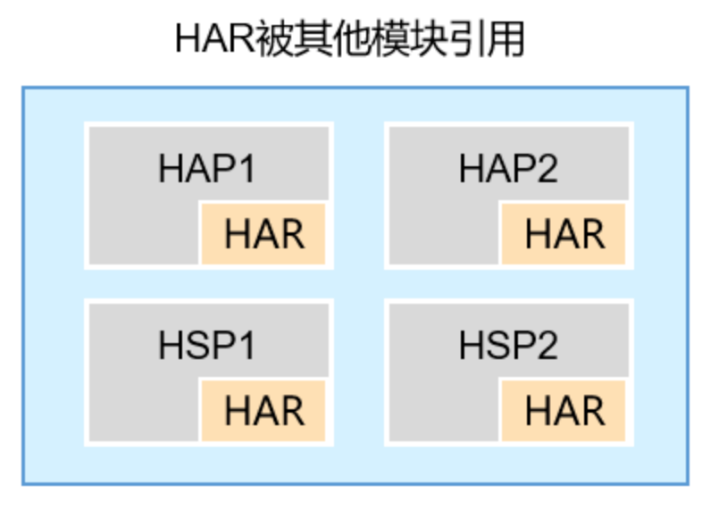

## 引言

在前面的系列文章中，我们从搭建开发环境开始，讲到如何使用、集成第三方插件，如何将现有项目进行鸿蒙化改造，以及上架审核等内容；还以高德地图的 HarmonyOS SDK 的使用为例，
讲解了如何将高德地图集成至项目当中。

## 混合开发

除了使用 Flutter 工程做为主项目开发以外，还有一种常见的开发方式，即混合开发，主项目工程为 HarmonyOS 工程， Flutter 工程以模块形式存在，，以依赖方式加载到主项目工程中，最终实现混合开发 。

想必混合开发也不会陌生，因为我们也简要介绍过，鸿蒙 Flutter 项目混合开发的两种形式。

从本章开始，我们将进一步深入，从原理出发、以工程实战为主线，探索这两种混合开发方式。

## 混合开发的两种方式

1. 以 Har 包的方式加载到 HarmonyOS 工程

HAR（Harmony Archive）是静态共享包，可以包含代码、C++库、资源和配置文件。通过HAR可以实现多个模块或多个工程共享ArkUI组件、资源等相关代码。



这种开发方式，就是将 Flutter 模块编译打包成 HAR 包，在原生鸿蒙项目中，以 Har 包的方式引入这个模块包，从而实现混合开发。

2. 以源码的方式加载到 HarmonyOS 工程

从方式 1 的介绍中，可以发现，每次 Flutter 模块的更新都需要重新编译成 Har 包，并且需要重新打包到原生鸿蒙工程中，非常麻烦。于是就有了源码依赖的方式，也就是说，

让原生鸿蒙工程依赖 Flutter 模块的源码，这样 Flutter 代码变更时，不需要重新打包成 Har 包，而且可以在开发过程中，实现热更新，实时刷新界面。


## 开发流程

1. 总目录

为了方便管理/演示，本示例的目录名为 ohos_flutter_module_demo, 我们将原生鸿蒙工程和 Flutter 模块都在这个目录下创建。

2. 创建原生鸿蒙工程

这个也就是宿主工程，这里我们使用 DevEco Studio，在 ohos_flutter_module_demo 目录下面， 创建一个原生鸿蒙工程，本文中工程名命名为 ohos_app。

3. 创建 Flutter 模块

这个流程都一样，我们可以使用命令以下命令创建一个 Flutter 模块:

```bash
flutter create --template=module my_flutter_module
```

最终项目目录结构如下：

```
ohos_flutter_module_demo
├── my_flutter_module
├── ohos_app
```

这样，为了方便维护，Flutter 模块在宿主项目外部创建，与宿主项目同级目录。本文中，上级目录为 ohos_flutter_module_demo, 其下有两个子目录，分别是 ohos_app (宿主项目)，和 my_flutter_module (Flutter 模块)。

3. 编译 Flutter 模块

如何使用 Har 包模式，需要先将 Flutter 模块编译成 Har 包；如何使用源码依赖的方式，则不需要这一步。

使用以下命令将 Flutter 模块编译成 Har 包：

```bash
flutter build har --debug
```

4. 配置原生鸿蒙工程

如果是通过 Har 包模式，则可将 Har 包添加至依赖文件中：

首先先构建出的 Har 包复制到 ohos 鸿蒙工程中：

```bash
cp -r my_flutter_module/.ohos/har/* ohos_app/har/
```

```json
  "dependencies": {
    "@ohos/flutter_module": "file:har/flutter_module.har",
    "@ohos/flutter_ohos":  "file:har/flutter.har"
  },
  "overrides" {
    "@ohos/flutter_ohos": "file:har/flutter.har",
  }
```

如果是通过源码模式，则需将 Flutter 模块的源码添加至依赖文件中：


```bash
  "dependencies": {
    "@ohos/flutter_module": "../flutter_module"
  }
```
4. 修改入口文件(可选)
修改入口文件, 将 Flutter 模块生成的 .ohos目录中的 EntryAbility.ets 和 Index.ets 文件复制到宿主工程中进行替换

```
cp my_flutter_module/.ohos/entry/src/main/ets/entryability/EntryAbility.ets ohos_app/entry/src/main/ets/entryability/EntryAbility.ets
cp my_flutter_module/.ohos/entry/src/main/ets/pages/Index.ets ohos_app/entry/src/main/ets/pages/Index.ets
```
