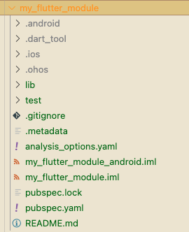
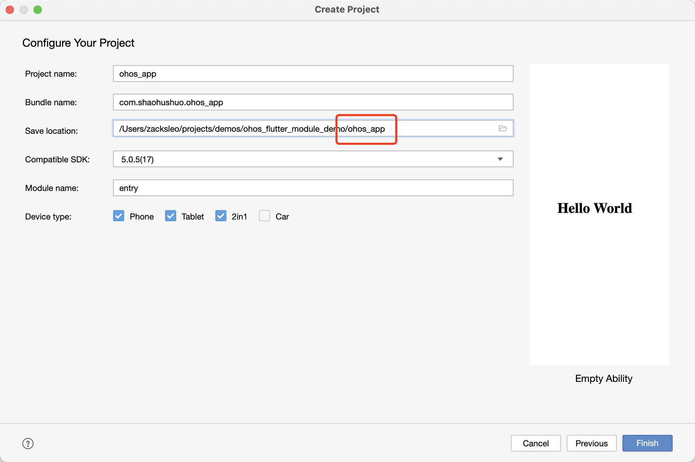
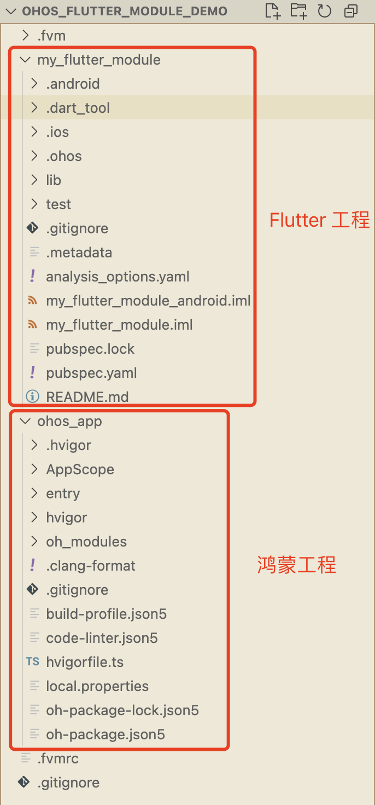

## 引言

在前面的文章[混合开发详解-2-Har包模式引入](./鸿蒙Flutter实战：22-混合开发详解-2-Har包模式引入.md)中，我们介绍了如何将 Flutter 模块打包成 Har 包，并引入到原生鸿蒙工程中。本文中，我们将介绍如何通过源码依赖的方式，将 Flutter 模块引入到原生鸿蒙工程中。

## 创建工作

### 创建一个根目录

```bash
mkdir ohos_flutter_module_demo
```

这个目录用于存放 flutter 项目和鸿蒙项目。

### 创建 Flutter 模块

首先创建一个 Flutter 模块，我们选择与 ohos_app 项目同级目录

```bash
flutter create --template=module my_flutter_module
```

> 如果使用了 fvm，首先确定当前目录使用的 flutter 版本为鸿蒙的 SDK 版本，如可以使用 `fvm use custom_3.22.0`设置，然后在 flutter 命令前加上 fvm，上面的命令也就变成了 `fvm flutter create --template=module my_flutter_module`

命令行出现以下输出：

```bash
Creating project my_flutter_module...
Resolving dependencies in `my_flutter_module`...
Downloading packages...
Got dependencies in `my_flutter_module`.
Wrote 12 files.

All done!
Your module code is in my_flutter_module/lib/main.dart.
```

创建 Flutter 模块成功之后，目录结构如下：




### 创建 DevEco 工程

使用 DevEco 在 ohos_flutter_module_demo 目录下，新建一个名为 ohos_app 的工程。



> 注意保存的目录为 xxxx/ohos_flutter_module_demo/ohos_app

DevEco 工程创建好之后，顺便对项目签名，签名方式如下。

```
DevEco Studio 打开 my_flutter_module/.ohos 工程后配置调试签名(File -> Project Structure -> Signing Configs 勾选 Automatically generate signature)，然后依次点击 Apply，OK。
```

创建成功后，整个目录结构如下：




可以看到，我们将 Flutter 模块放在了与 ohos_app 项目同级。my_flutter_module 中自动创建了 .ohos 目录, 这也是一个简单的鸿蒙项目，不过会包含一个名为 flutter_module 的模块。

## 配置源码依赖

### .ohos软连接至主项目

由于[开源鸿蒙官方文档](https://gitcode.com/openharmony-sig/flutter_samples/blob/br_3.7.12-ohos-1.1.0/ohos/docs/04_development/%E5%A6%82%E4%BD%95%E4%BD%BF%E7%94%A8%E6%B7%B7%E5%90%88%E5%BC%80%E5%8F%91%20module.md)中给出的方案并不理想，这里我们使用软连接的方案，来实现基于源码的联动开发。

正常情况下，my_flutter_module 创建成功后，会包含一个 .ohos 目录，这个目录是一个鸿蒙工程（里面包含 flutter_module 模块），它可以做为 Flutter 的宿主运行。但是这个宿主工程，并不是我们期望的 ohos_app, 两个工程没有任何关联，所以也无法联动开发。

所以我们执行以下操作：

```bash
# ⚠️首先需要将flutter_module复制到鸿蒙宿主工程，避免出现错误 “Error: Parse ohos module.json5 error: Error: Can not found module.json5 at”
cp -r my_flutter_module/.ohos/flutter_module ohos_app/

# 进入目录 my_flutter_module，在此处创建软连接
cd my_flutter_module
#  删除 .ohos 目录
rm -rf .ohos
# 创建软连接至鸿蒙宿主工程，根据需要更改目录名称
ln -s ../ohos_app .ohos
```

通过以上操作，我们将 .ohos 目录以软连接的方式，替换成了 ohos_app 鸿蒙工程，这样一来，当我们运行 Flutter 代码时，就会把 ohos_app 做为宿主，这样就实现了联动源码开发，也支持 hot reload （热重载）。


### 更新项目

经过上操作后，我们运行 `flutter run` , 让 Flutter 来自动更新项目配置

```bash
# 运行 flutter 代码，以更新鸿蒙项目目录
flutter run
```

查看 `ohos_app/build-profile.json5` 文件， 可以看到命令会自动添加模块配置：

```diff
  "modules": [
    ...
+    {
+      "name": "flutter_module",
+      "srcPath": "./flutter_module"
+    }
  ]
```

同时查看 ohos_app/har 目录，可以看到自动生成了 flutter.har 文件。


可以看到运行 `flutter run`时，控制台输出以下内容：

```bash
Launching lib/main.dart on FMR0224904009635 in debug mode...
start hap build...
...
Running Hvigor task assembleHap...                                 95.7s
✓ Built ../ohos_app/entry/build/default/outputs/default/entry-default-signed.hap.
installing hap. bundleName: com.shaohushuo.ohos_app
```

经过一段等待之后，我们的 App 就运行起来了，应用展示的是一个原生页面，Flutter 引擎及 Flutter 页面并没有加载，我们将在接下来的章节中，介绍这些实现。


## 参考资料

- [撰写双端平台代码（插件编写实现）](https://docs.flutter.cn/platform-integration/platform-channels/)
- [鸿蒙Flutter功能开发](https://gitcode.com/openharmony-sig/flutter_samples/blob/master/ohos/docs/04_development/README.md)
- [鸿蒙add-to-app示例](https://github.com/0xZOne/ohos-flutter-add2app)
- [如何使用混合开发 module](https://gitcode.com/openharmony-sig/flutter_samples/blob/master/ohos/docs/04_development/%E5%A6%82%E4%BD%95%E4%BD%BF%E7%94%A8%E6%B7%B7%E5%90%88%E5%BC%80%E5%8F%91%20module.md)