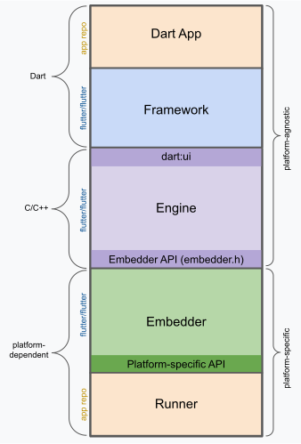
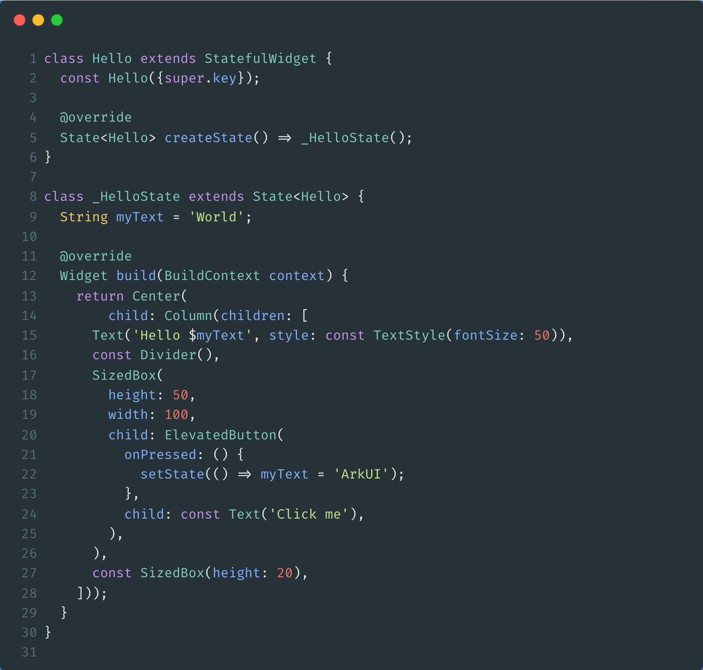
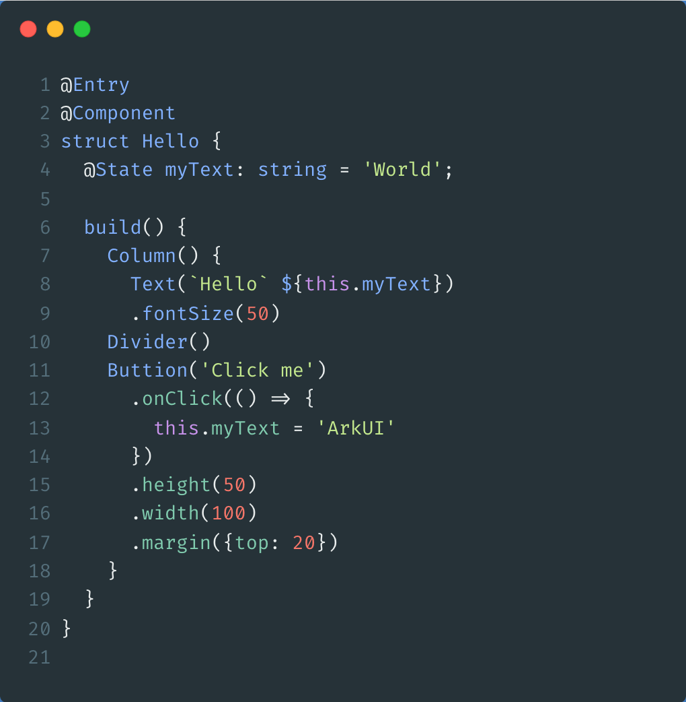

# 鸿蒙Flutter三方库适配指南：Flutter相关知识基础

## Flutter 三层结构



1. Dart 层（Framework 层）

使用 Dart 语言 编写

提供了 UI 框架（widgets、material、cupertino） 和 渲染、手势、动画 等上层 API

面向开发者，负责 业务逻辑 与 界面搭建


2. C/C++ 层（Engine 层）

Flutter 的 引擎核心，主要用 C/C++ 编写

包含 Skia/Impeller 图形渲染引擎、文本排版（libtxt）、Dart VM

负责 图形渲染、文本排版、GPU 加速 等底层性能相关工作


3. Platform-dependent 层（Embedder 层）

负责与 宿主操作系统（Android、iOS、HarmonyOS、Windows、macOS、Linux） 的交互

提供 事件处理（输入、手势）、系统 API 调用、插件通信（Platform Channels）

不同平台有各自的 embedder 实现，使 Flutter 可以运行在不同系统上


## Dart 语言基础知识

Dart 是一种面向对象的编程语言，Flutter 使用 Dart 作为其主要开发语言。

```dart
// 变量声明
String hi = 'hello';

// 常量声明
const String hello = 'hello';

// 类定义
class Person {
  String name = '';
  int age = 0;

  Person(String n, int a) {
    name = n;
    age = a;
  }

  String getName() {
    return name;
  }
}

Person p1 = Person('Alice', 25);
```

### 注组

在 Flutter 中，通常使用注解来标识组件和入口点：

```dart
// 主程序入口
void main() => runApp(MyApp());

// 组件装饰器
class MyApp extends StatelessWidget {
  @override
  Widget build(BuildContext context) {
    return MaterialApp(
      title: 'Flutter Demo',
      home: Scaffold(
        appBar: AppBar(title: Text('Hello')),
        body: Center(child: Text('Hello World')),
      ),
    );
  }
}
```

## Flutter 与 ArkUI 对比


| 对比维度 | Flutter | ArkUI |
|----------|---------|-------|
| 开发语言 | Dart | ArkTS |
| 架构层次 | Dart Framework → C++ Engine → Platform Embedder | ArkUI Framework（ArkTS） → ArkUI Engine → HarmonyOS 系统服务 |
| 渲染引擎 | Skia 渲染 | 自研 ArkUI 渲染引擎 |
| 平台支持 | Android / iOS / Windows / macOS / Linux / Web | HarmonyOS / OpenHarmony |
| 开发体验 | 热重载、Widget 声明式 UI | ArkTS 声明式 UI、实时预览（Previewer） |
| 插件机制 | Platform Channels + FFI 调用，插件生态丰富 | 模块化开发 + 系统 API 调用，生态成长中 |
| 生态现状 | 全球活跃开发者 280 万+，pub.dev 插件库庞大 | - |
| 优势 | 跨平台统一 UI、生态成熟 | 原生性能高、系统集成度深、分布式支持 |
| 适用场景 | 跨平台应用、多端兼容 | 鸿蒙原生应用、分布式设备协同 |


## 语法对比

| Flutter | ArkUI |
|---------|-------|
|   |  |

## 参考资料

- [Flutter架构概览](https://docs.flutter.cn/resources/architectural-overview)
- [ArkUI](https://developer.huawei.com/consumer/cn/arkui/)