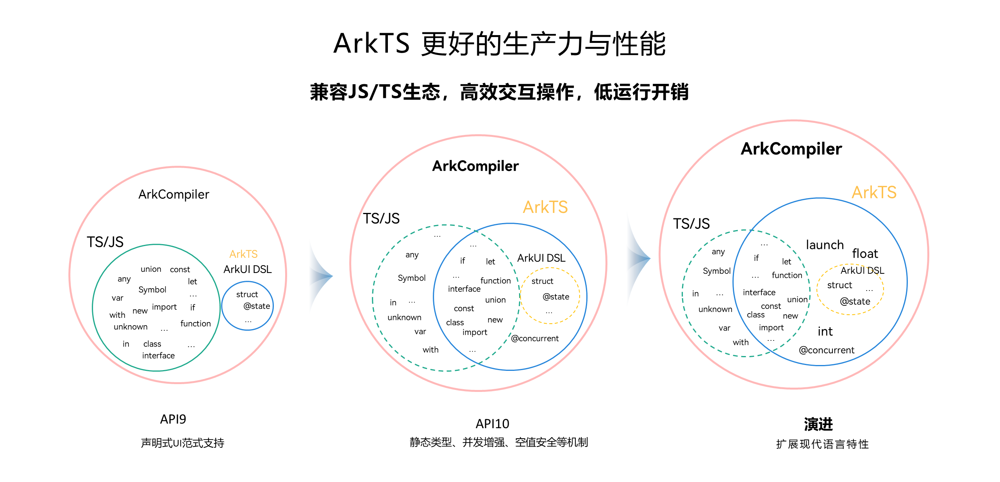

# ArkTS 相关知识基础

ArkTS 基于 Typescript 语言扩展，强制使用静态类型，基于性能考虑增加更多约束机制。

```ts
// 变量声明
let hi: string = 'hello';

// 常量声明
const hello: string = 'hello';

// 类定义
class Person {
  name: string = '';
  age: number = 0;
  constructor(n: string, a: number) {
    this.name = n;
    this.age = a;
  }

  getName(): string {
    return this.name;
  }
}

let p1 = new Person('Alice', 25);
```

### 注解

```ts
@Component
@Entry
class HelloWorld {
    build() {}
}
```


## ArkTS 与 JS/TS 的关系



## 参考资料

- [ArkTS官方文档](https://developer.huawei.com/consumer/cn/arkts/)