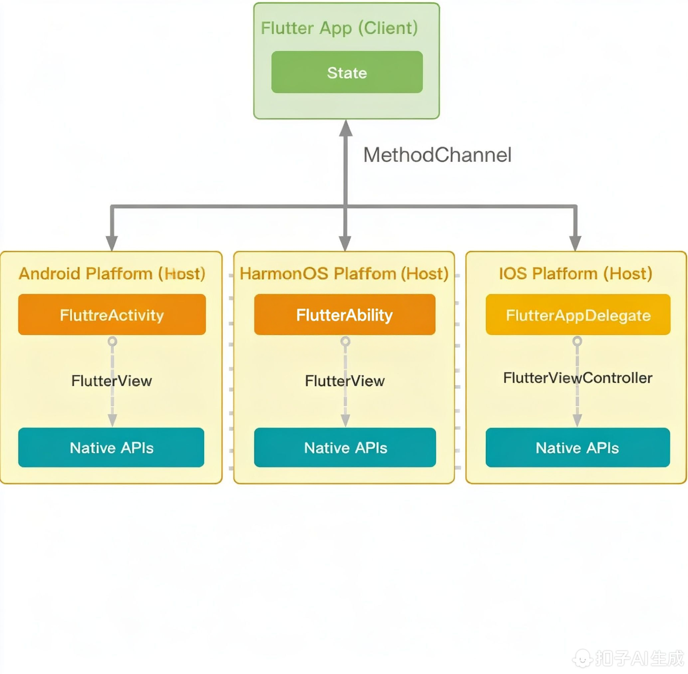

# 鸿蒙Flutter三方库适配指南：插件适配原理

大家好，欢迎来到鸿蒙Flutter三方库适配指南系列教程。今天我们将会深入探讨鸿蒙系统中Flutter插件的适配原理。这部分内容对于想要将现有的Flutter插件移植到鸿蒙平台或者为鸿蒙平台开发新插件的开发者来说非常重要。

## 什么是Flutter插件？

在开始讲解适配原理之前，我们先简单回顾一下Flutter插件的概念。Flutter插件是一种特殊的包，它允许Flutter Dart代码与平台特定的API进行交互。这些API可以是Android的Java/Kotlin代码、iOS的Objective-C/Swift代码，或者在我们的情况下，是鸿蒙系统的ArkTS代码。

Flutter插件的核心作用是在Flutter框架和原生平台之间建立桥梁，让开发者能够在Dart层面调用平台相关的功能，比如相机、地理位置、传感器等。

## Flutter插件的工作原理

在传统的移动平台上，Flutter通过Platform Channels机制实现Dart代码与原生代码的通信。这包括三种类型的通道：

1. MethodChannel：用于方法调用（最常见的形式）
2. EventChannel：用于流式数据传输，如传感器数据
3. BasicMessageChannel：用于字符串和半结构化的数据传递

当Dart代码需要调用平台功能时，它会通过这些通道发送消息给原生端，原生端处理完后再将结果通过同样的通道返回给Dart端。

## 鸿蒙平台下的挑战

当我们把目光转向鸿蒙平台时，我们会发现一些新的挑战：

1. 鸿蒙系统有自己的架构和API体系，不同于Android和iOS
2. 鸿蒙使用ArkTS作为主要开发语言，而不是Java/Kotlin或Swift/Objective-C
3. 鸿蒙有自己的Ability和Extension机制，与传统移动平台的Activity/ViewController概念有所不同
4. 鸿蒙的线程模型和生命周期管理也与其他平台存在差异

这意味着我们不能直接复用现有的Flutter插件，而需要针对鸿蒙平台进行专门的适配。

## 鸿蒙Flutter插件适配方案

基于鸿蒙系统的能力重新实现插件功能。我们需要：

1. 创建鸿蒙原生模块，使用ArkTS实现所需功能
2. 通过鸿蒙的FFI（外部函数接口）机制暴露接口
3. 在Flutter端通过Platform Channel调用这些接口

这种方法的优点是能够充分利用鸿蒙系统的新特性和性能优化，缺点是需要从零开始实现所有功能。





## 插件适配的关键步骤

无论选择哪种方案，插件适配通常都需要经过以下几个关键步骤：

### 1. 分析原插件功能

首先要彻底理解原插件的功能和实现方式，包括：
- 插件提供了哪些API
- 使用了哪些平台特定的功能
- 如何处理异步操作
- 错误处理机制

### 2. 调研鸿蒙平台对应能力

了解鸿蒙系统是否提供了相应的功能以及如何使用：
- 查阅鸿蒙官方文档
- 寻找对应的ArkTS API
- 理解鸿蒙的权限申请机制

### 3. 设计适配方案

基于前面的分析，设计具体的适配方案：
- 确定需要重新实现的部分
- 规划Dart端和原生端的接口
- 考虑性能和用户体验

### 4. 实现原生端功能

在鸿蒙平台上使用ArkTS实现相应功能：
- 创建Ability或Extension
- 实现具体业务逻辑
- 处理生命周期和异常情况

### 5. 建立通信桥梁

通过Platform Channel建立Dart与ArkTS之间的通信：
- 在Dart端定义MethodChannel
- 在ArkTS端注册对应的处理函数
- 实现参数传递和结果返回

### 6. 测试验证

进行全面的测试确保功能正常：
- 功能测试
- 性能测试
- 兼容性测试
- 边界条件测试

## 实际案例演示

让我们通过一个简单的例子来更好地理解这个过程。假设我们需要适配一个获取设备信息的插件。

在Dart端，我们会有这样的代码：

```dart
import 'package:flutter/services.dart';

class DeviceInfoPlugin {
  static const MethodChannel _channel = MethodChannel('device_info');

  static Future<String> get platformVersion async {
    final String version = await _channel.invokeMethod('getPlatformVersion');
    return version;
  }
}
```

在鸿蒙原生端，我们需要创建对应的ArkTS实现：

```typescript
import { MethodCall, MethodChannel } from '@hw/flutter-bridge';

export class DeviceInfoHandler {
  private channel: MethodChannel;

  constructor() {
    this.channel = new MethodChannel('device_info');
    this.channel.setMethodCallHandler(this._handleMethodCall.bind(this));
  }

  private _handleMethodCall(call: MethodCall): Promise<any> {
    switch (call.method) {
      case 'getPlatformVersion':
        return Promise.resolve(this._getPlatformVersion());
      default:
        return Promise.reject('Unknown method: ' + call.method);
    }
  }

  private _getPlatformVersion(): string {
    // 获取鸿蒙系统版本信息
    return deviceInfoApi.getVersion();
  }
}
```

## 最佳实践建议

在进行插件适配时，以下几点建议可以帮助你更高效地完成工作：

1. **渐进式适配**：不要试图一次性适配所有功能，优先实现核心功能。

2. **保持接口一致性**：尽量保持与原插件相同的Dart API，减少对Flutter应用代码的修改。

3. **充分的错误处理**：考虑到平台差异，要做好充分的异常处理和错误提示。

4. **合理的性能优化**：注意避免不必要的跨平台调用，合理使用缓存机制。

5. **详细的文档记录**：记录适配过程中遇到的问题和解决方案，方便后续维护和其他开发者参考。

## 总结

鸿蒙Flutter插件适配是一个需要综合考虑多种因素的技术任务。通过理解Flutter插件的工作原理，掌握鸿蒙平台的特性，采用合适的适配方案，我们就能够成功将Flutter生态系统中的优秀插件带到鸿蒙平台上来。

今天的课程就到这里。在下一节中，我们将通过实际动手操作来体验如何具体实现一个插件的鸿蒙适配。谢谢大家！