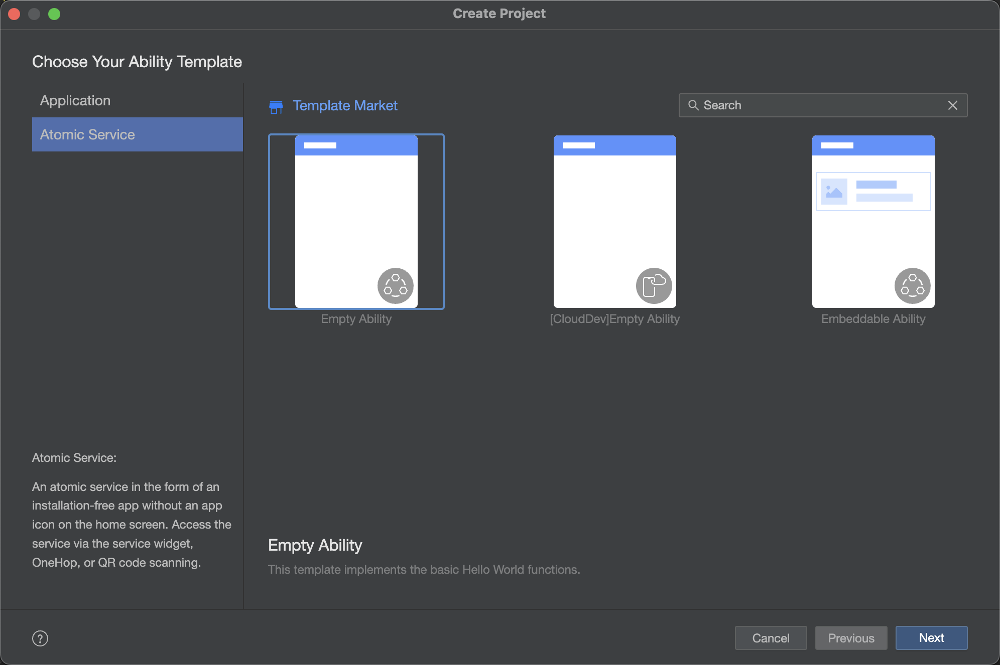
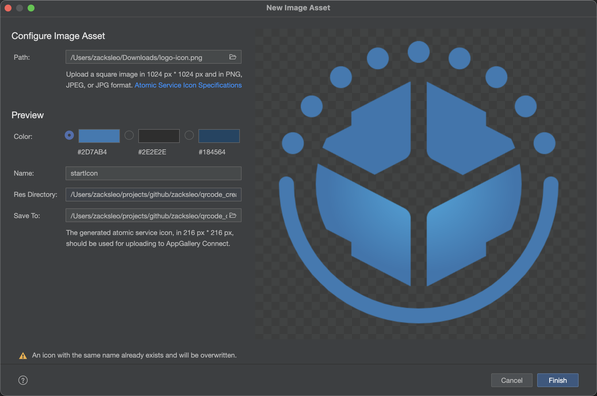
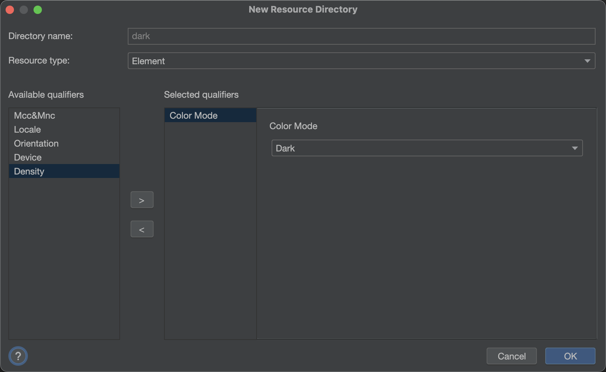
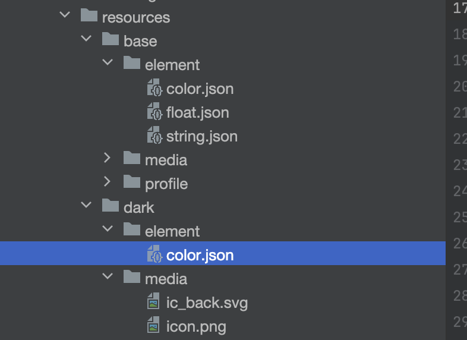

# 鸿蒙原生开发手记：01-元服务开发

## 简介

元服务是鸿蒙中的一种轻量应用形态，无需下载，直接运行。类似于微信小程序，但与小程序不同的是，元服务更加轻量。

元服务使用原生开发，是系统级提供的，无论从易用性、性能、体验上，都要比小程序好。

## 创建元服务

使用 DevEco，点击 Create, 左侧模板选择 Atomic Service，右侧模板选择 Empty Ability。根据提示依次点击下一步。

## 图标生成

图标设计好以后，可以使用 DevEco 自带的生成工具，生成符合元服务规范的图标。在 `src/main/resources/media` 目录处，右键 `New->Image Asset`

将会弹出制作对话框，选择设计好的图标，勾选主颜色，则可以生成元服务的图标。

## 编写页面

打开 `src/main/ets/pages/index.ets` 页面，写法与应用的 ArkUI 一致，在此处开始编写页面代码。

### API限制

需要注意的时，部分 API 在元服务中无法使用，在 HarmonOS 文档里面，打开 API参考，可以在左侧勾选 `筛选元服务API集`, 就可以看到哪些 API 可能在元服务中使用。

### 权限限制

元服务中存在更多的权限限制, 在 API 文档中，支持元服务使用的权限会在`元服务API`处注册。

[受限开放权限](https://developer.huawei.com/consumer/cn/doc/harmonyos-guides-V5/restricted-permissions-V5#section89191571295)

## 深色模式

在 `src/main/resources` 目录下，新建一个 `dark`目录，在 resouces 目录处右键，选择 `Resource Directory`, 在对话框中左侧选择 `Color Mode`,
然后点击 OK

在便携代码时，通过行如 `$r('app.color.primary_button_color')`的方式引用颜色变量，则会在深色模式时，引用 `resources/dart/element/color.json` 文件中，查找对应的颜色变量。对于其他资产，如图片，也是同样的使用方法。

## 服务卡片

元服务可以添加服务卡片，详细介绍见《鸿蒙原生开发手记：02-服务卡片开发》

## 开发测试

在 DevEco 点击运行，设备上可以从负一屏上方的“搜索”按钮，点击进入我的元服务列表，在最近里面可以看到刚安装的元服务。

## 上架

详细介绍见 《鸿蒙Flutter实战：13-鸿蒙应用打包上架流程》，先添加应用项目，再添加元服务。

## 注意事项

1. 导航栏处点击失效问题。
在使用 `RelativeContainer` 时发现，按钮如果处在顶部与元服务右侧按钮同一行的位置区域时，点击事件不触发，此时不使用 `RelativeContainer` 组件，改用其他，如 `Column`。

## 参考资料

- [元服务开发指南](https://developer.huawei.com/consumer/cn/doc/atomic-guides-V5/atomic-service-definition-V5)
- [ArkTS API参考](https://developer.huawei.com/consumer/cn/doc/harmonyos-references-V5/arkts-api-V5?catalogVersion=V5)
- [权限说明](https://developer.huawei.com/consumer/cn/doc/harmonyos-guides-V5/health-permission-description-V5)
