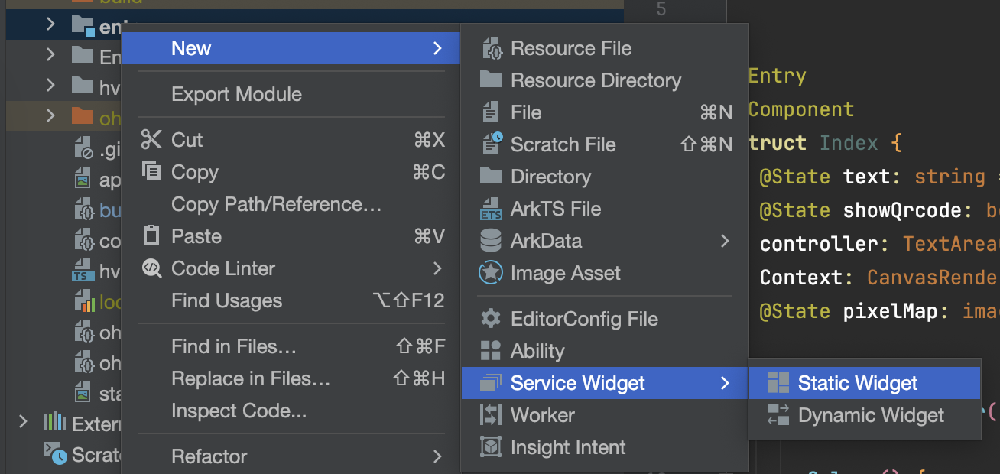
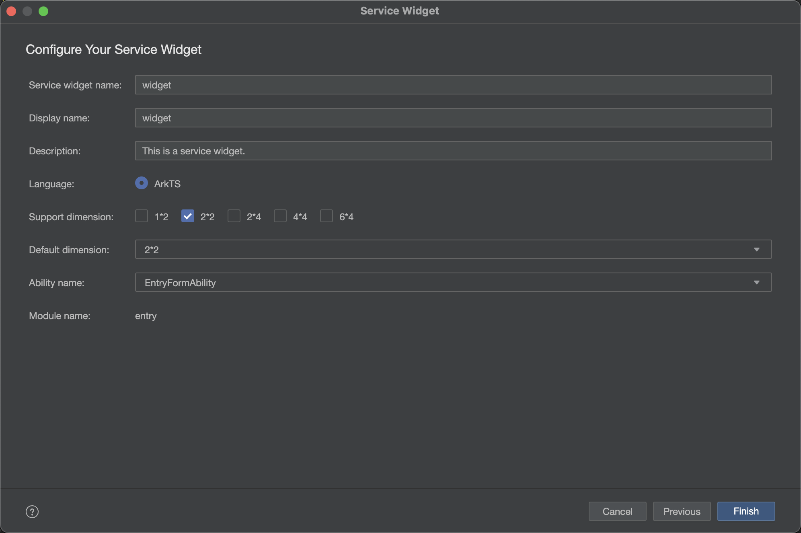

# 鸿蒙原生开发手记：02-服务卡片开发

## 介绍

服务卡片是一直桌面小组件，可以放置在桌面上等位置，一触即达。

服务卡片分为静态卡片和动态卡片两类。本文介绍静态卡片。

## 创建

回到 DevEco，在目录`entry`右键，点击创建 Service Widget，选择 `Static Widget`, 点击 Next。



输入名称，选择支持的卡片大小，点击确定创建卡片。

其中 2*2 代表 2行2列，1*2 代表1行2列。



编写卡片界面

## 交互

### 点击事件传参

这里使用 ArkUI 编写界面，不过不能使用点击事件，转而应该使用 FormLink，相关的事件在 formability 侧接受，通过不同的参数，调用 router.push 打开不同的页面。

```arkts
    FormLink({
      action: this.ACTION_TYPE,
      abilityName: this.ABILITY_NAME,
      params: {
        action: this.MESSAGE
      }
    }) {
    ...
    }
```

### 参数接收

在 `entryability` 中的 `onCreate` 和 `onNewWant` 生命周期中，来接收参数

```ts
  onCreate(want: Want, launchParam: AbilityConstant.LaunchParam): void {

    if(want?.parameters?.params) {
      let params: Record<string, Object> = JSON.parse(want.parameters.params as string);
      this.selectPage = params.action as string;
      console.log("selectPage", this.selectPage);
    }
  }

  onNewWant(want: Want, launchParam: AbilityConstant.LaunchParam): void {
    console.log('onNewWant');
    if (want?.parameters?.params) {
      // want.parameters.params 对应 postCardAction() 中 params 内容
      let params: Record<string, Object> = JSON.parse(want.parameters.params as string);
      this.selectPage = params.action as string;
      hilog.info(DOMAIN_NUMBER, TAG, `onNewWant selectPage: ${this.selectPage}`);
    }
    if (this.currentWindowStage !== null) {
      this.onWindowStageCreate(this.currentWindowStage);
    }
  }
```

## 注意事项

1.运行时，请使用正常模式，服务卡片不支持 HotReload ，而且热重载模式下卡片无法正常显示。

## 参考资料

- [服务卡片文档](https://developer.huawei.com/consumer/cn/sdk/form-kit/)
